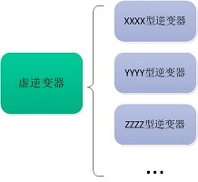

# 万物生长——渐进式开发光伏云系统实践（一）

“光伏云”是近年来在新能源领域兴起的概念，通过运用现代互联网技术，光伏云系统可以深度分析客户运营数据，帮助用户智能化的管理光伏资产，甚至提供电量、电站交易，社区交互等功能。

从Web系统的角度来看，光伏云系统主要有以下特点：

1. 单用户数据量较高。以常见的每5分钟记录一次为例，单个设备每年的原始数据量为10万条，采用中小型逆变器的电站各类需采集的设备接近上百，单个电站的数据量每年就在1000万条左右。因此对于拥有多个电站的区域投资商用户来讲，仅设备原始数据数量就很可观。
2. 数据可视化为交互重点。类似其他偏中后台的分析管理系统，由于面向专业用户，光伏云系统的交互更注重功能性，目前功能开发的热点大多基于数据的分析，数据可视化是光伏云系统前端交互设计的重点。

在光伏云系统的开发实践中，我们发现由于以下的原因，传统的“确定需求——设计架构——开发”方式难以正常的运作：

1. **业务形式多样，定制化需求要求高。**作为一个新兴的概念，光伏云系统尚未形成标准的业务模式，存在云端数据中心提供接入、区域集控中心部署等多种业务模式。具体功能需求也尚在摸索之中，往往用户会提出定制化的需求。故光伏云系统的开发是一个持续的、不断积累与改进的过程。
2. **领域专业处于不断研发中，功能变动频繁。**不同于一般的互联网产品，光伏云系统的功能设计高度依赖电气、气象等领域专业，算法设计往往由其他专门的研发部门承担，开发往往需要与领域专业的研发工作异步并行。
3. **电站实况千差万别，设备数据模型碎片化。**光伏云系统往往定位的是“后市场”，即目标用户是已建成的电站，接入方式（就地通讯管理机、电站二次监控、设备通讯模块等）也任由用户选择，这就导致了设备接入的数据难有统一的标准。传统的构建统一的原始数据表结构的尝试要么无法覆盖所有实际设备，要么过于冗余影响性能，且新电站、新型号的设备还在不断加入，因此并不合适。

基于对以上问题的思考，我们借鉴近年来在前端领域广为应用的 **“渐进式”**理念对光伏云系统的开发进行实验性的重构。

植物总是从土壤中的一粒种子长出，种子伸出的根系必须稳固枝叶才能繁茂，我们提出**“核数据”**的概念作为光伏云系统的“种子”与“根系”。核数据是按照底层实际设备型号组织的原始数据，数据模型如实反映实际设备上送点表的结构。它是底层千差万别的设备在光伏云系统中的存在形式，是光伏云系统与电站的交界面接口。

受[徐飞](https://www.zhihu.com/question/51907207/answer/136559185)观点的启发，核数据按照“主张最少”原则对设备数据模型进行约定。传统的做法在数据入库时会对设备会进行归类与抽象，对特定类别的设备数据会有一定的要求，这种要求就是“主张”，因为要考虑各种情况，主张往往带来数据项冗余或缺失，无法优雅的代表底层。核数据不对设备进行任何的归类与抽象，不同型号设备的数据点表单独的映射在数据库中，力求主张最少，忠实的反映底层设备的原貌。

明确了根基，就可以按照类似[Vue.js](http://link.zhihu.com/?target=https%3A//cn.vuejs.org/)的“自底向上增量开发”方式构建系统。通过档案数据集合中存储的各种关系与映射，核数据可以被抽象为**“虚设备”**数据供给上层业务功能使用。类似于数据模型与领域模型之别，核数据仅面向底层各种设备，而虚设备数据仅面向上层业务功能，它按照光伏云系统的常见结构，设有虚逆变器、虚并网接口设备、虚环境监测仪、虚汇流箱等。

一种虚设备，可对应多个实际设备的型号，因此虚设备可起到传统标准设备数据表归类和标准化实际设备的作用；

同时一种实际设备的型号也可对应为多种不同的虚设备，很多集成多种功能的设备通信只会有一张点表，在数据库中只对应一个核数据集合，但根据业务的需要可映射到不同的标准虚设备数据模型。通过这种多对多的灵活方式，在满足业务需求的情况下，最大化避免数据库的不足与冗余。

鉴于光伏云业务的摸索与领域专业的研发进度，开发的需求会动态增长，因此我们计划首先专注于一点作为功能模块开发的起点。 **“数据分析与可视化”**在光伏云系统所有当前和未来的的业务中居于基础而核心的地位，其他诸如预测、管理、交易等业务都源于此基础，我们以此作为渐进式展开功能模块的起点。

在技术栈的选择上，由于本次实验性重构开发不存在迁移成本与生产环境压力，我们希望探索次世代Web技术的应用，按照“大前端”的理念，尽可能采用基于**JavaScript**的方案统一全栈，毕竟“可以由JavaScript实现的需求，最终都将有JavaScript实现”。后续随着开发实践的过程，本系列将对各个部分进行阐述与总结。