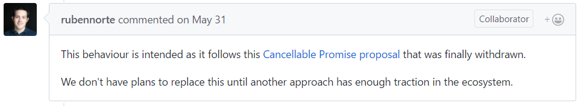

> 本文分析了axios是如何通过朴素而简单的方式，实现了网络请求封装中的各种扩展功能的

封装，是程序员除了造轮子之外最喜欢做的事了。各种API、库要想用得顺手，一般都要根据实际需求进行一层封装，以便优化一些粗糙的调用方式，添加一些扩展的实用功能。

一个好的封装，除了满足应用场景、具备通用性易用性外，特别重要的一个要求就是：

> 薄

用最少的代码，既要实现调用优化和功能扩展，又不能增加过多体积和性能的负担。

很多经典的框架和库都为“薄”提供了很好的范例。

Axios是近年来备受推崇的一个网络请求库，它以基于Promise的方式封装了浏览器的XMLHttpRequest和服务器端node http请求，使得我们可以用es6推荐的异步方式处理网络请求。

为何axios能得到大佬的钦定，在不同的生态圈都有优异的表现呢？在官方文档中，是这样介绍它的feature的：

- 从浏览器创建XMLHttpRequest
- 从node.js创建http请求
- 支持Promise API
- 拦截请求与响应
- 转换请求与响应数据
- 取消请求
- 自动转换JSON数据
- 支持客户端XSRF攻击防护


可以看到，除了Promise封装网络请求的基本功能外，它还实现了多个实用的扩展功能，但最终打包出来的axios.min.js文件体积只有13KB，确实是做到了“薄”。

下面本文将带学习赏鉴axios的源码是如何通过朴素而巧妙的方式实现拦截请求与响应、转换请求与响应数据、自动转换JSON数据、支持客户端XSRF攻击防护等功能的，有以下两点说明：

- 本文不在分析XMLHttpRequest具体封装的代码，作为历史的特殊产物XMLHttpRequest API的设计较为粗糙，不具有太多借鉴学习意义，且已逐渐被Fetch API替代
- 取消请求这一功能不做分析，该功能是基于cancelable promises的提案实现的，该提案已被撤回，开发组目前暂停了该功能的更新支持，今后将换用其他方式（如果有的话）实现：



# 拦截请求与响应

**功能的使用**

首先我们来看文档中关于axios拦截器的使用，axios拦截器分为请求拦截器和响应拦截器。用户可以通过then方法为请求添加回调，而拦截器中的回调将在then中的回调之前执行：

```
// 添加请求拦截器
axios.interceptors.request.use(function (config) {
    // Do something before request is sent
    return config;
  }, function (error) {
    // Do something with request error
    return Promise.reject(error);
  });

// 添加响应拦截器
axios.interceptors.response.use(function (response) {
    // Do something with response data
    return response;
  }, function (error) {
    // Do something with response error
    return Promise.reject(error);
  });
```

移除已经设置的拦截器

```
var myInterceptor = axios.interceptors.request.use(function () {/*...*/});
axios.interceptors.request.eject(myInterceptor);
```

给自定义的axios实例添加拦截器

```
var instance = axios.create();
instance.interceptors.request.use(function () {/*...*/});
```

**Promise then() 方法回顾**

axios作为基于Promise的请求封装，其拦截器是通过`then`方法实现的，通过[教程](http://es6.ruanyifeng.com/#docs/promise#Promise-prototype-then)我们先简单回顾一下该方法：

Promise 实例具有`then`方法，也就是说，`then`方法是定义在原型对象`Promise.prototype`上的。它的作用是为 Promise 实例添加状态改变时的回调函数。前面说过，`then`方法的第一个参数是`Resolved`状态的回调函数，第二个参数（可选）是`Rejected`状态的回调函数。

`then`方法返回的是一个新的`Promise`实例（注意，不是原来那个`Promise`实例）。因此可以采用链式写法，即`then`方法后面再调用另一个`then`方法。

```
getJSON("/posts.json").then(function(json) {
  return json.post;
}).then(function(post) {
  // ...
});

```

上面的代码使用`then`方法，依次指定了两个回调函数。第一个回调函数完成以后，会将返回结果作为参数，传入第二个回调函数。

采用链式的`then`，可以指定一组按照次序调用的回调函数。这时，前一个回调函数，有可能返回的还是一个`Promise`对象（即有异步操作），这时后一个回调函数，就会等待该`Promise`对象的状态发生变化，才会被调用。

```
getJSON("/post/1.json").then(function(post) {
  return getJSON(post.commentURL);
}).then(function funcA(comments) {
  console.log("Resolved: ", comments);
}, function funcB(err){
  console.log("Rejected: ", err);
});

```

上面代码中，第一个`then`方法指定的回调函数，返回的是另一个`Promise`对象。这时，第二个`then`方法指定的回调函数，就会等待这个新的`Promise`对象状态发生变化。如果变为`Resolved`，就调用`funcA`，如果状态变为`Rejected`，就调用`funcB`。

**源码分析**

通过Axios的构造函数，我们可以看出，interceptors中的request和response两者都是通过一个InterceptorManager的对象进行管理：

> \lib\core\Axios.js    L15

```
function Axios(instanceConfig) {
  this.defaults = instanceConfig;
  this.interceptors = {
    request: new InterceptorManager(),
    response: new InterceptorManager()
  };
}
```

来到InterceptorManager构造函数的定义文件：

> \lib\core\InterceptorManager.js    L5

    function InterceptorManager() {
      this.handlers = [];
    }
    
    /**
     * 在栈中添加interceptor
     * @param {Function} fulfilled 作为Promise的resolve回调
     * @param {Function} rejected 作为Promise的reject回调
     * @return {Number} interceptor ID以便移除时使用
     */
    InterceptorManager.prototype.use = function use(fulfilled, rejected) {
      this.handlers.push({
        fulfilled: fulfilled,
        rejected: rejected
      });
      return this.handlers.length - 1;
    };
    
    /**
     * 从栈中移除interceptor
     * @param {Number} id use方法返回的ID
     */
    InterceptorManager.prototype.eject = function eject(id) {
      if (this.handlers[id]) {
        this.handlers[id] = null;
      }
    };
    
    /**
     * 遍历所有的interceptor，会跳过已移除的interceptor
     * @param {Function} fn 遍历执行的回调
     */
    InterceptorManager.prototype.forEach = function forEach(fn) {
      utils.forEach(this.handlers, function forEachHandler(h) {
        if (h !== null) {
          fn(h);
        }
      });
    };
    
    module.exports = InterceptorManager;

InterceptorManager的对象中是通过handlers数组变量存储拦截器，数组每项同时包含了分别作为Promise中resolve和reject的回调。InterceptorManager类中还包含了对该数组变量的添加、移除、遍历方法。

值得一提的是，移除方法是通过直接将该项设为null实现的，而不是用splice剪切该数组，遍历方法中也增加了相应的null值处理。这样做一方面使得每一项ID保持为项的数组索引不变，另一方面也避免了重新剪切拼接数组的性能损失。

InterceptorManager的具体使用依然要回到Axios类的定义中来：

> \lib\core\Axios.js    L46

```
Axios.prototype.request = function request(config) {
  
  // 挂载interceptor中间件
  var chain = [dispatchRequest, undefined];
  var promise = Promise.resolve(config);

  this.interceptors.request.forEach(function unshiftRequestInterceptors(interceptor) {
    chain.unshift(interceptor.fulfilled, interceptor.rejected);
  });

  this.interceptors.response.forEach(function pushResponseInterceptors(interceptor) {
    chain.push(interceptor.fulfilled, interceptor.rejected);
  });

  while (chain.length) {
    promise = promise.then(chain.shift(), chain.shift());
  }

  return promise;
};
```

当执行request的时候，实际请求（dispatchRequest）、请求拦截、响应拦截通过一个数组变量chain来存储和管理，最终都通过then方法添加到promise中，具体的存储和挂载过程如下图：


通过巧妙的利用unshift、push、shift等数组队列、栈方法，实现了请求拦截、执行请求、响应拦截的流程设定，注意无论是请求拦截还是响应拦截，越先添加的拦截器总是越“贴近”执行请求本身。

# 转换请求与响应数据

**功能使用**

通过transformRequest和transformResponse，可链式的传递函数数组对数据进行转换：

```
{
  // 转换请求数据，注意只有'PUT', 'POST', 和'PATCH'有请求体
  // 最后一个转换函数必须返回合法的请求数据类型
  transformRequest: [function (data) {
    // Do whatever you want to transform the data
    return data;
  }],

  // 转换返回数据，将在then回调之前执行
  transformResponse: [function (data) {
    // Do whatever you want to transform the data
    return data;
  }],
}
```

**源码分析**

在实际执行请求的transformResponse中，会调用transformData函数，对请求和响应数据进行转换：

> \lib\core\dispatchRequest.js    L30, L56, L69

```
module.exports = function dispatchRequest(config) {
  
  // Transform request data
  config.data = transformData(
    config.data,
    config.headers,
    config.transformRequest
  );

  return adapter(config).then(function onAdapterResolution(response) {
    
    // Transform response data
    response.data = transformData(
      response.data,
      response.headers,
      config.transformResponse
    );

    return response;
  }, function onAdapterRejection(reason) {
    if (!isCancel(reason)) {

      // Transform response data
      if (reason && reason.response) {
        reason.response.data = transformData(
          reason.response.data,
          reason.response.headers,
          config.transformResponse
        );
      }
    }

    return Promise.reject(reason);
  });
};
```

在transformData函数中会遍历调用设置的函数数组中的各个函数：

> \lib\core\transformData.js    L13

```
module.exports = function transformData(data, headers, fns) {

  utils.forEach(fns, function transform(fn) {
    data = fn(data, headers);
  });

  return data;
};
```

值得一提的是，通过阅读源码可知，用户设置的转换函数，可将headers作为第二个参数，这样在转换函数中可以根据headers中的信息执行不同的操作。

# 自动转换JSON数据

在默认情况下，axios将会自动的将传入的data对象序列化为JSON字符串，将响应数据中的JSON字符串转换为JavaScript对象。这是一个非常实用的功能，但实现起来非常简单：

> \lib\defaults.js    L28

```
var defaults = {

  transformRequest: [function transformRequest(data, headers) {
    
    if (utils.isObject(data)) {
      setContentTypeIfUnset(headers, 'application/json;charset=utf-8');
      return JSON.stringify(data);
    }
    return data;
  }],

  transformResponse: [function transformResponse(data) {
    
    if (typeof data === 'string') {
      try {
        data = JSON.parse(data);
      } catch (e) { /* Ignore */ }
    }
    return data;
  }],
};
```

# 支持客户端XSRF攻击防护

XSRF攻击，即“跨站请求伪造”(Cross Site Request Forgery)攻击。通过窃取用户cookie，让用户在本机（即拥有身份 cookie 的浏览器端）发起用户所不知道的请求。防护XSRF攻击的一种方法是设置特殊的xsrf token，axios实现了对这种方法的支持：

> \lib\defaults.js L68

```
{
  // `xsrfCookieName` is the name of the cookie to use as a value for xsrf token
  xsrfCookieName: 'XSRF-TOKEN', // default

  // `xsrfHeaderName` is the name of the http header that carries the xsrf token value
  xsrfHeaderName: 'X-XSRF-TOKEN', // default
}
```

> \lib\adapters\xhr.js L108

```
module.exports = function xhrAdapter(config) {
  return new Promise(function dispatchXhrRequest(resolve, reject) {
    
    // Add xsrf header
    // This is only done if running in a standard browser environment.
    // Specifically not if we're in a web worker, or react-native.
    if (utils.isStandardBrowserEnv()) {
      var cookies = require('./../helpers/cookies');

      // Add xsrf header
      var xsrfValue = (config.withCredentials || isURLSameOrigin(config.url)) && config.xsrfCookieName ?
          cookies.read(config.xsrfCookieName) :
          undefined;

      if (xsrfValue) {
        requestHeaders[config.xsrfHeaderName] = xsrfValue;
      }
    }
  });
};
```

除了以上feature中列出的主要扩展功能外，axios还提供了诸如内置的jwt、错误处理等其他实用功能。

# 总结

我们可以看到，axios在实现封装网络请求所需的各项扩展功能时，都是使用的最朴素JavaScript源生方法，并且总是通过简单的链式then方法将这些功能与核心的promise对象关联。此外各种优化性能的方法，也都是采用的很基本的原理。

这对于现在前端离了工具库就写不了代码的现状，很有启发意义。