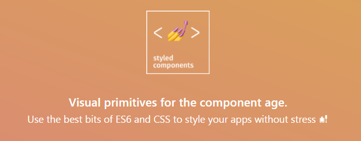
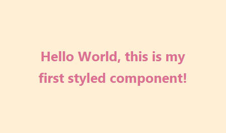
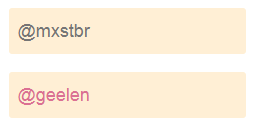

>  Styled-components 是目前 React 样式方案中最受关注的一种，它既具备了 css-in-js 的模块化与参数化的优点，又完全使用CSS的书写习惯，不会引起额外的学习成本。本文是 styled-components 作者之一 Max Stoiber 所写，首先总结了前端组件化样式中的最佳实践原则，然后在此基础上介绍了 styled-components 的设计理念：“强制你使用组件化样式的最佳实践”。本文对于前端组件、样式的实践原则等很有启发性，同时本人也十分推荐 styled-components 这一方案。
>
>  原文链接：[Styled Components: Enforcing Best Practices In Component-Based Systems](https://www.smashingmagazine.com/2017/01/styled-components-enforcing-best-practices-component-based-systems/)
>
>  欢迎关注本人知乎专栏：[熵与单子的代码本](https://zhuanlan.zhihu.com/c_90568250)

在 web 中构建用户交互是很困难的，因为 web 和其中的 CSS 最初是为文档设计的。一些聪明的开发者发明了诸如 BEM 、ITCSS 、 SMACSS 的方法或规范，通过使用组件使得构建用户交互更为简单和可维护。

当我们的观念转变为构建组件化用户交互后，就步入了所谓的“组件时代“。React 、 Ember 以及最近的Angular 2 等JavaScript框架的崛起、W3C为标准化web原生组件系统做出的努力、模式库与设计规范被认为是构建web应用的正确方式，这种种的事件都表明这一变革正在发生。

```
const Button = styled.a`
	/* This renders the buttons above... Edit me! */
	display: inline-block;
	border-radius: 3px;
	padding: 0.5rem 0;
	margin: 0.5rem 1rem;
	width: 11rem;
	background: transparent;
	color: white;
	border: 2px solid white;

	/* The GitHub button is a primary button
	 * edit this to target it specifically! */
	${props => props.primary && css`
		background: white;
		color: palevioletred;
	`}
`
```

*一个使用 styled-components 的 React 组件*

# 组件化系统中的最佳实践

随着我们构建的组件化应用越来越多，我们总结了一些最佳实践。今天我想讨论其中最主要的三条：使用小型、功能单一、独立的组件；分离容器组件与展示性组件；使用唯一的 CSS 类名。

**小型化组件**

使用组件来组织应用比使用CSS类更有优势。例如，想象有一个 `Button` 组件在 DOM 中渲染 `<button class="btn">` 。另外也可以渲染一个更大更重要的按钮。创建一个更大的按钮可以简单的在 DOM 中添加 `btn--primary` 类： `<button class="btn btn--primary">` 。

如果不想要求组件的使用者必须具体知道要添加哪个类，可以给 `Button` 组件添加 `primary` 属性。这样创建一个基本按钮将只需简单的： `<Button primary />` ！以下是实现方式：

```
// Button.js

function Button(props) {
  const className = `btn${props.primary ? ' btn—-primary' : ''}`
  return (
    <button className={className}>{props.children}</button>
  );
}
```

现在，使用者就不需要知道它具体应用了哪个类；他们只需要渲染一个基本按钮。当设置参数 `primary` 之后发生了什么属于组件的**实现细节**。改变这个按钮的样式、类或者行为只需要编辑创建组件的那一个文件，而不用改变使用它的上百个文件。

**分离容器组件与展示性组件**

在 React 中，某些组件可能具有 state 。试着分离处理数据、逻辑（比如数据格式化）的组件与处理样式的组件。通过分离这两者，追溯代码中的变化将会简便很多。

如果后端 API 格式改变了，你所要做的只是进入你的容器组件，确保在新数据格式下渲染与之前相同的展示性组件，这样一切都会运行完好。

另一方面，如果 APP 的视觉设计或用户体验需要更改，你所要做的只是进入你的展示性组件并确保他们自身能正确显示。由于这些组件并不关注它们在何时何处被渲染，你也没有改变渲染哪个组件，一切都会运行完好。

通过区分这两种类型的组件，你就不需要同时进行多个不相关联的更改，这避免了意外错误。

**使用唯一类名**

回到我们的 `Button` 组件，他有一个 `.btn` 类。改变这个类的样式应该只影响 `Button` 。如果在我的 `.btn` 类中改变 `background-color` 搞乱了 header 的布局并使得 footer 从三列变为了两列，那肯定出问题了。这违背了整个使用独立组件的前提。

这从根本上要求了所有类在CSS中只能使用了一次（在类似 `.clearfix` 的“ mixins “之外）。这样，类似上文中的 bug 就永远不会发生了。

问题其实一直出在人上面。程序中遇到 bug 了？它出现是因为有人把它写在那里了。如果程序能够脱离人而存在，那 bug 不会成为一个问题。你遇到和修改的每个 bug 都是由人的错误造成的。

在前端圈有一个有名的笑话：

> 两个 CSS 参数走进一家酒吧（ bar ），另一家酒吧的凳子就倒了。

这个笑话如此广为流传，就说明了太多开发者曾经遇到过这种类型的 bug 。不管你多努力地去避免，它总是发生，特别是在团队中。

考虑到这种种事情，Glen Maddern 和我开始坐下来考虑新时代的样式。我们并不想重新发明或者抛弃 CSS ；它是为样式而造的语言并且浏览器原生支持。相反，让我们利用 CSS 中最好的部分，并且让组件化的系统中几乎不再有人为的错误。

# 执行最佳实践



Styled-components 最基本的理念就是通过**移除样式与组件之间的对应关系**来强制执行最佳实践。回想一下你使用过的任何样式方法，样式片段与 HTML 之间总是有一个对应关系。

在标准 CSS 中，这会是一个类名（或者也许是一个 ID ）。在 React 的 styles in JavaScript 库中，这是通过一个变量设置一个类或给 `style` 属性传递一个 JavaScript 对象。

由于我们对每个类只想使用一次，不如直接移除这种对应关系如何？

结果证明，通过这种方式，我们还强制了容器组件与展示性组件的分离，而且我们也确保了开发者只能构建小型而单一的组件。

Styled-components 另一个有趣的特性是他让你在 JavaScript 中写**真 CSS **（而不仅仅是类似 CSS 的 JavaScript 对象）。它利用了 ECMAScript 2015 （新版的 JavaScript 标准）中一个不太常用的特性，称为标签模板字面量（译者注：先前ES版本中称为模板字符串），使得开发者有良好的使用体验。

# 基本用法

现在，你一定想知道它长什么样。那让我们来看一看！

```
const Title = styled.h1`
  color: palevioletred;
  font-size: 1.5em;
  text-align: center;
`;
```

你可以和其他 React 组件一样地去使用它：

```
<Wrapper>
  <Title>Hello World, this is my first styled component!</Title>
</Wrapper>
```



*以上组件在浏览器中的显示效果*

这里面的内容不多，所以让我们解读一下这段代码。

`styled.h1` 是一个函数，当调用时返回一个 React 组件，将一个 `h1` 渲染到 DOM中。你可能会好奇：“我们在哪里调用那个函数了？我只看到反引号，没有括号！”，这正是 ECMAScript 2015 特性起作用之处。

以上你看到的是一个标签模板字面量，是 JavaScript 语言的新特性。（使用 styled-components 不需要特别的工具）你可以使用反引号（如 `styled.h1`` ` ）调用函数，并且他们会接受传入的字符串作为第一个参数。随着我们深入，你会看到它与正常通过括号调用函数有何不同，但是现在我们先这样放一放。

所以，这里调用 `styled.h1 ` 返回了一个 React 组件。这个 React 组件被添加了一个类，这个类由 styled-components 自动生成并确保唯一。这个类名将会关联有你传入模板字面量的样式。

总之，这意味着调用 `styled.h1 ` 返回了一个 React 组件，它具有你传入模板字面量的样式。

**完全支持 CSS**

由于 styled-components 就是 CSS ，它很好的支持所有的 CSS。媒体查询、伪选择器、甚至嵌套都可以。我们生成一个类名，然后将 CSS 注入到 DOM ；所以任何在 CSS 中适用的，在 styled-components 中同样适用。

```
const Input = styled.input`
  font-size: 1.25em;
  border: none;
  background: papayawhip;
  /* ...more styles here... */

  &:hover {
    box-shadow: inset 1px 1px 2px rgba(0,0,0,0.1);
  }

  @media (min-width: 650px) {
    font-size: 1.5em;
  }
`;
```

这个 `Input` 组件现在将拥有很好的鼠标悬停样式，并将在大屏幕上稍稍变大一些。让我们看看这些输入框有或者没有占位符时的样子：



*以上组件在浏览器中的显示效果*

如你所见，创建一个具有样式的容器组件或者创建一个具有逻辑的展示性组件是不可能的。我们也创建的是许多小型组件并将他们组合到大型容器中，而且由于没有可见的类，我们不可能多次使用他们。

从根本上来讲，通过使用 styled-components ，我们必须去构建一个良好的组件系统——没别的可能。他强制我们使用最佳实践——不需要特别的代码架构审查。

Styled-components 提供很多很好的特性，比如内置主题与完全的 React Native 支持。我建议你看一看文档并在你的项目中试一试。不用担心最佳实践，这使得开发体验大大提升和加快。我当然是很偏心的，但我再也不想回去使用其他的样式方法构建 React 应用了。

# 参考

[styled-components 官方文档](https://www.styled-components.com/docs)

[标签模板字面量介绍](http://es6.ruanyifeng.com/#docs/string#标签模板)