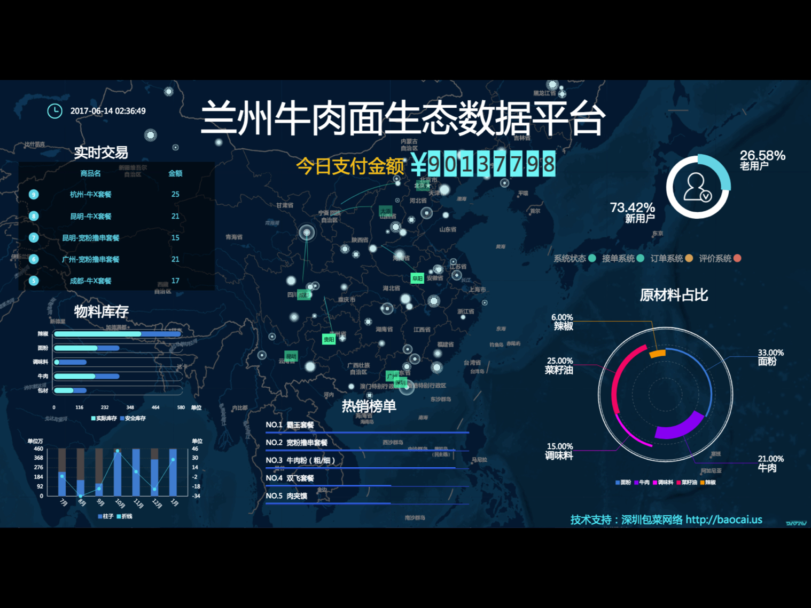
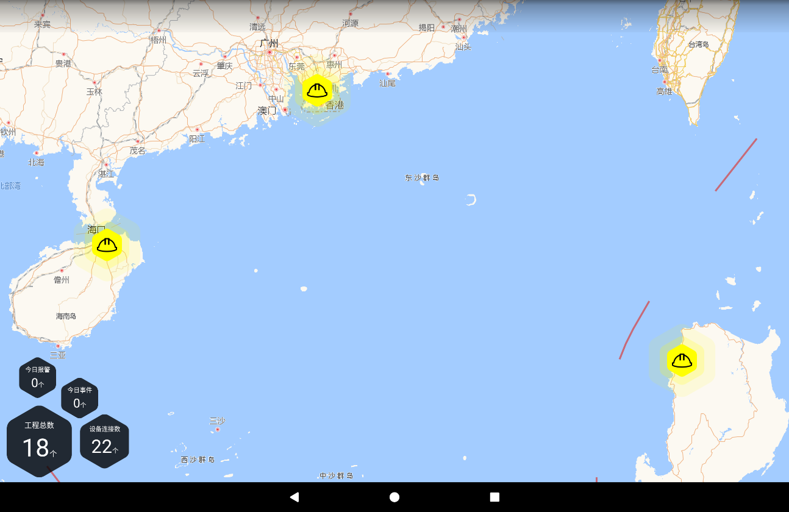
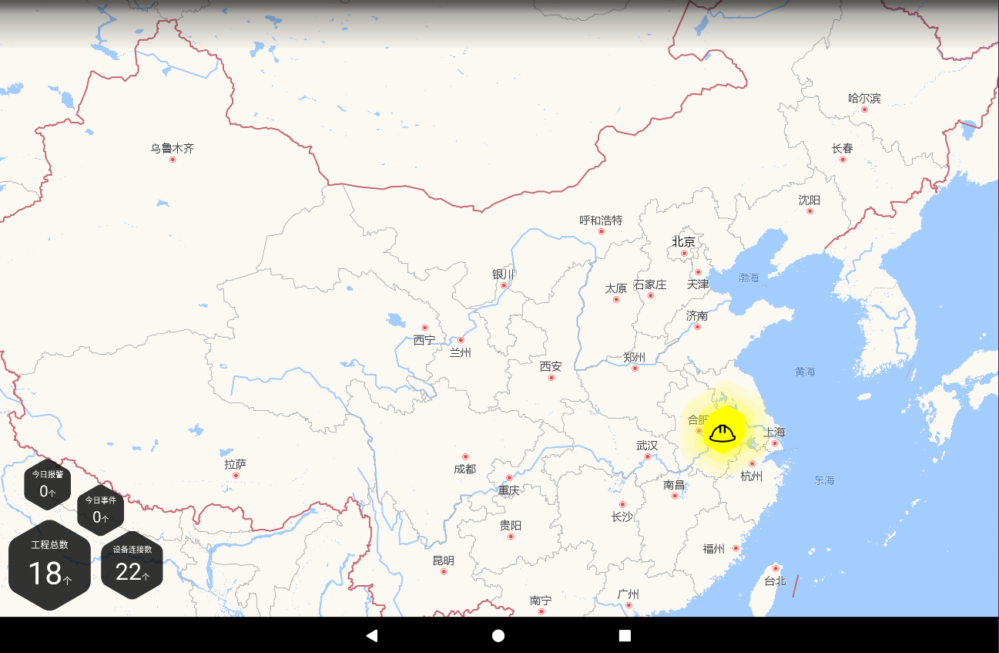
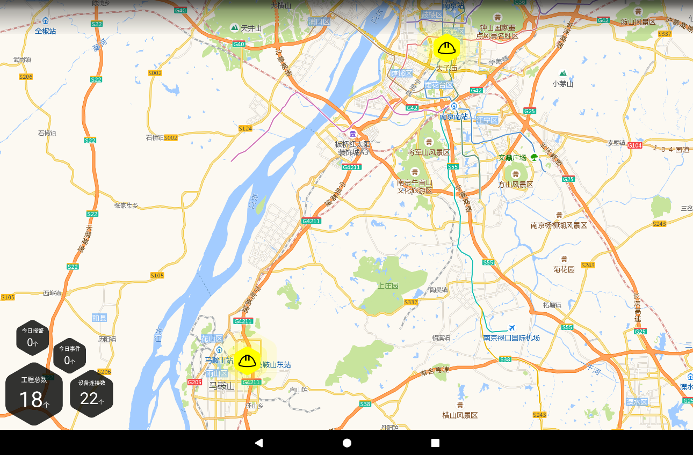

> 本文介绍了在 React Native 平板开发中使用高德地图组件的一个案例，重点介绍了如何计算并缩放到所需状态，以及地图 Webview 与 React Native 通信的方式。
>
> 
>
> 欢迎关注我的专栏： [熵与单子的代码本](https://zhuanlan.zhihu.com/c_90568250) 。

在数据可视化展示系统中，地理信息系统（ GIS ）组件已经几乎是必备的了。

GIS 组件通过地图的形式直观地展现数据项在地理上的分部，以地图上点标注（ Marker ）的颜色、大小等表示数据量。在可交互系统中，还可通过点击点标注弹出或跳转详情页面，或实现各种 LBS （基于位置的服务）。

GIS 组件往往位于主页面的中心位置，或作为整体背景，例如下图（来自阿里云 DataV 官网），其重要性可见一斑。



在通用的数据可视化系统中，可以使用[高德地图](http://lbs.amap.com/)或[百度地图](http://lbsyun.baidu.com/)等第三方平台提供的 API 或 SDK ，实现所需的 GIS 组件。

我最近在做工业云的平板客户端，其中就有 GIS 组件的需求，它作为管理工程项目的导航入口，通过地图上的点标注反映用户所拥有项目的地理位置，可点击弹出详情组件和进入管理页面。

与数据可视化大屏相比，该 GIS 组件除了常见的要求外，要着重注意两点：

- 不同于定制的展示大屏，工业云面对大量用户，不同用户项目数量、分布千差万别，可能只有同城的几个项目，也可能分布全国的几百个项目，或者可能有海外项目。
- 该组件是作为管理工程项目的导航入口，因此更注重交互体验，不管对于持有多少项目的用户，都希望有一个便捷的方式可以快速选择到所需项目。

#Web vs Native

该项目使用 React Native 开发， GIS 系统选用高德地图。

目前高德地图支持的开发方式有 Web API 与原生 SDK 两种。对于React Native的架构来说，分别可以通过 Webview 或封装原生模块的方式来使用。

一般从性能角度讲，原生模块都是优于 Webview 的。但是经过调研与实验，我们发现无论是 Web API 还是原生 SDK，地图图层的渲染内容都是通过网络远程获取的，远程加载速度是最主要的性能瓶颈，因此原生 SDK 的渲染和计算优势并不会带来多大的体验提升。

而采用 Web 方式则具有很明显的跨平台通用性和开发调试的方便性，因此我们采用 Web 方式。

# 自动聚焦与缩放

为了满足前文所述的要求，我们希望进入 GIS 页面时，地图就满足以下要求：

- 视域的中心就是项目地理分部的中心；
- 视域缩放到既能容纳所有项目，又能使他们尽量分散布满全屏；

不同于一般的分布中心问题，由于屏幕是一个矩形，可以按照这样的思路考虑：想象地理上有一个矩形，以所有项目坐标中，经度最高和最低的两条经线为竖边，纬度最高和最低的两条纬线为横边，则这个矩形就是能放下所有项目的最小矩形，它的中心点就是我们要找的屏幕中心，把它缩放到屏幕刚好能放下的比例就是我们要找的比例。

按照这个思路，我们就可以开发 GIS 组件了。

关于 Webview 中如何引入高德 Web API 就不赘述了。为方便使用React Native组件的变量，我们将业务逻辑的脚本通过模板字符串生成，并通过 `injectedJavaScript` 参数注入 Webview 。

地图的中心坐标通过构造函数配置项参数的 `center` 、 `zoom` 两个字段确定，其中 zoom 为 3 - 19 之间的整数，表示缩放等级。

首先，将 React Native 传入的项目数组通过 JSON 序列化后引入脚本，并为项目数少于两个的情况设置缺省值：

```
const projects = ${JSON.stringify(projectsTest)};

let center = [103.7, 36];
let zoom = 5;

if (projects.length == 1) {
  center = projects[0].position;
}
```

（完整代码见文末）

**距离像素比（ scalePerPixel ）**

高德地图文档中没有给出每个等级对应的距离像素比（ scalePerPixel ）， Web API 中也没有函数直接获取，不过仅试验可以得知，每减小一个缩放等级，距离像素比增大一倍，公式如下：

```
ScalePerPixel = 0.2531 * Math.pow(2, (19 - zoom))
```

**最小包含矩形**

对于至少两个项目的情况，首先遍历一下项目数组，获取最小包含矩形四边的经纬线和中心点，并通过 `AMap.GeometryUtil.distance()` 获取其地理长度。为减小地区弧度造成的误差，长度按穿过中心点的经纬线取：

```
let lngMax = -180;
let lngMin = 180;
let latMax = -90;
let latMin = 90;
for(let project of projects) {
  lngMax = Math.max(lngMax, project.position[0]);
  lngMin = Math.min(lngMin, project.position[0]);
  latMax = Math.max(latMax, project.position[1]);
  latMin = Math.min(latMin, project.position[1]);
}
center = [(lngMax + lngMin) / 2, (latMax + latMin) / 2];
const markersDistance = [
  AMap.GeometryUtil.distance(new AMap.LngLat(lngMax, center[1]), new AMap.LngLat(lngMin, center[1])),
  AMap.GeometryUtil.distance(new AMap.LngLat(center[0], latMax), new AMap.LngLat(center[0], latMin)),
];
```

然后是寻找合适的缩放等级。由于缩放等级超过 11 后，已缩小至区县以下，故我们只需考虑 3 - 11 的整数这有限的几种情况，可从 11 开始逐级缩小比例，直至所有的点都在屏幕区域即可：

```
for (let i = 11; i >= 3; i -= 1) {
  // 获取屏幕尺寸
  const viewportSize = AMap.DomUtil.getViewport(document.getElementById('container'));
  // 通过距离像素比公式将地理长度转为像素尺寸
  const getScalePerPixel = (zoom) => 0.2531 * Math.pow(2, (19 - zoom));
  const markersSize = [markersDistance[0] / getScalePerPixel(i), markersDistance[1] / getScalePerPixel(i)];
  // 检查屏幕是否能容纳（四边留有余量）
  if (markersSize[0] < (viewportSize.getWidth() - 100) && markersSize[1] < (viewportSize.getHeight() - 100)) {
    zoom = i;
    break;
  }
}
```

这样计算出的 `center` 、 `zoom` 构造的地图对象即会缩放至满足要求的状态：



**方案优势**

之前我们曾考虑过另一种方案，是按“国-省-市”的行政区划等级进行缩放，如果所有项目都在某市，就缩放至该市级的地图，都在某省就缩放至某省级的地图，如果各省都有就缩放至全国地图。

这个方案是最自然想到的一种，但其实在很多情况下存在问题。比如，某用户的项目主要在南京和马鞍山两地（了解南京的人应该知道确实有很多这样的业主）。按照该方案，南京与马鞍山分属江苏和安徽两省的，行政区划上两者没有任何共同点，会被判定缩放至国家级别地图：



但是我们现在的方案则是按照地理位置直接判定，故可缩放至合理的状态：



并且，本文方案所处理的数据都为较短的数组，且仅在获取屏幕尺寸时涉及 DOM ，不会带来性能上的损失。

#点选事件与消息通信

由于高德地图点标注自带的点选不具备取消选择、清除等功能，且 React Native 层需要获取一些信息，故点选事件与消息通信好需要自行编写。点选逻辑如下：

- 同一时间只能选中一个项目，点击点标注选择项目，向 React Native 组件发送消息，通知选择哪个项目和点标注在屏幕上的位置，以便 React Native 在合适的位置弹出对应的详情组件；
- 如果点击已选择的项目，则取消选择；
- 点击地图上空白位置也取消选择；

**消息规约**

虽然现在只有简单的选择和清除项目两种消息，但为了扩展性，还是定个简单的消息规约：

```
{
  type: 'select',
  payload: {
    projectIndex,
    point: [ x, y ],
  },
}

{
  type: 'clear',
}
```

**添加事件**

因为是移动端平板，所有点击事件类型采用 touchend 。针对地图、点标注是否已点选的不同状态，选择调用 select 或 clear 两个函数处理：

```
const select = (e) => {
  markerSelected = e.target;
  markerSelected.setIcon(iconSelected);
  window.postMessage(JSON.stringify({
    type: 'select',
    payload: {
      projectIndex: markerSelected.getExtData(),
      point: [e.pixel.getX(), e.pixel.getY()],
    },
  }));
};
const clear = () => {
  markerSelected.setIcon(iconNormal);
  markerSelected = null;
  window.postMessage(JSON.stringify({
    type: 'clear',
  }));
};

const touchMap = (e) => {
  if (markerSelected) {
    clear();
  }
};
const touchMarker = (e) => {
  if (markerSelected) {
    if (markerSelected === e.target) {
      clear();
      return;
    }
    markerSelected.setIcon(iconNormal);
  }
  select(e);
};

AMap.event.addListener(map, 'touchend', touchMap);
markers.forEach((marker) => {
  AMap.event.addListener(marker, 'touchend', touchMarker);
});
```

其中消息的发送通过 Webview 的 `window.postMessage()` ，在 React Native 组件中通过 `onMessage` 参数设置处理的回调函数，消息对象通过 `JSON.parse(e.nativeEvent.data)` 获取。

React Native 组件与 Webview 之间的双向通信都是通过字符串的形式，故前后要进行相应的 JSON 序列化与解析。

值得注意的是，在高德地图 JS API 中 Map 、 Marker 等对象成员变量都是私有的，不可以直接通过 `XX.XX` 的形式取到，需用对应的 get 方法获取： `XX.getXX()` 。故点标注附带的项目信息要通过以下方式使用：

```
// 定义
new AMap.Marker({
  ...
  extData: projectIndex,
});

// 使用
payload: {
  ...
  projectIndex: markerSelected.getExtData(),
},
```

这样点选项目之后的业务就可以完全在 React Native 层进行处理了。

# Webview 组件代码

Webview 组件完整的代码如下：

```
import React from 'react';
import {
  WebView,
  Platform,
} from 'react-native';
import PropTypes from 'prop-types';

const URI_PREFIX = Platform.OS === 'android' ? 'file:///android_asset/web/WebMap/' : '';

export default class WebMap extends React.Component {
  static propTypes = {
    style: PropTypes.oneOfType([
      PropTypes.object,
      PropTypes.array,
    ]),
    projects: PropTypes.array.isRequired,
    onMessage: PropTypes.func.isRequired,
  }

  constructor(props) {
    super(props);
    this.projectsShown = [];
    this.props.projects.forEach((project) => {
      if (project.position) {
        this.projectsShown.push(project);
      }
    });
    this.script = `
      const projects = ${JSON.stringify(this.projectsShown)};

      let center = [103.7, 36];
      let zoom = 5;

      if (projects.length == 1) {
        center = projects[0].position;
      }
      
      if (projects.length >= 2) {
        let lngMax = -180;
        let lngMin = 180;
        let latMax = -90;
        let latMin = 90;
        for(let project of projects) {
          lngMax = Math.max(lngMax, project.position[0]);
          lngMin = Math.min(lngMin, project.position[0]);
          latMax = Math.max(latMax, project.position[1]);
          latMin = Math.min(latMin, project.position[1]);
        }
        center = [(lngMax + lngMin) / 2, (latMax + latMin) / 2];
        const markersDistance = [
          AMap.GeometryUtil.distance(new AMap.LngLat(lngMax, center[1]), new AMap.LngLat(lngMin, center[1])),
          AMap.GeometryUtil.distance(new AMap.LngLat(center[0], latMax), new AMap.LngLat(center[0], latMin)),
        ];
        for (let i = 11; i >= 3; i -= 1) {
          const viewportSize = AMap.DomUtil.getViewport(document.getElementById('container'));
          const getScalePerPixel = (zoom) => 0.2531 * Math.pow(2, (19 - zoom));
          const markersSize = [markersDistance[0] / getScalePerPixel(i), markersDistance[1] / getScalePerPixel(i)];
          if (markersSize[0] < (viewportSize.getWidth() - 100) && markersSize[1] < (viewportSize.getHeight() - 100)) {
            zoom = i;
            break;
          }
        }
      }

      const map = new AMap.Map('container',{
        resizeEnable: true,
        zoom,
        center,
        layers: [
          new AMap.TileLayer.Satellite(),
          new AMap.TileLayer(),
        ],
      });

      const iconNormal = new AMap.Icon({
        image: './marker-normal.png',
        size: new AMap.Size(108, 118),
        imageSize: new AMap.Size(108, 118),
      });
      const iconSelected = new AMap.Icon({
        image: './marker-selected.png',
        size: new AMap.Size(108, 118),
        imageSize: new AMap.Size(108, 118),
      });
      const markers = projects.map((project, projectIndex) => new AMap.Marker({
        position: project.position,
        title: project.name,
        icon: iconNormal,
        offset: new AMap.Pixel(-54,-59),
        map,
        extData: projectIndex,
      }));

      let markerSelected = null;

      const select = (e) => {
        markerSelected = e.target;
        markerSelected.setIcon(iconSelected);
        window.postMessage(JSON.stringify({
          type: 'select',
          payload: {
            projectIndex: markerSelected.getExtData(),
            point: [e.pixel.getX(), e.pixel.getY()],
          },
        }));
      };
      const clear = () => {
        markerSelected.setIcon(iconNormal);
        markerSelected = null;
        window.postMessage(JSON.stringify({
          type: 'clear',
        }));
      };

      const touchMap = (e) => {
        if (markerSelected) {
          clear();
        }
      };
      const touchMarker = (e) => {
        if (markerSelected) {
          if (markerSelected === e.target) {
            clear();
            return;
          }
          markerSelected.setIcon(iconNormal);
        }
        select(e);
      };

      AMap.event.addListener(map, 'touchend', touchMap);
      markers.forEach((marker) => {
        AMap.event.addListener(marker, 'touchend', touchMarker);
      });
    `;
  }

  render() {
    return (
      <WebView
        style={this.props.style}
        source={{ uri: `${URI_PREFIX}index.html` }}
        injectedJavaScript={this.script}
        onMessage={(e) => { this.props.onMessage(JSON.parse(e.nativeEvent.data)); }}
      />
    );
  }
}
```

