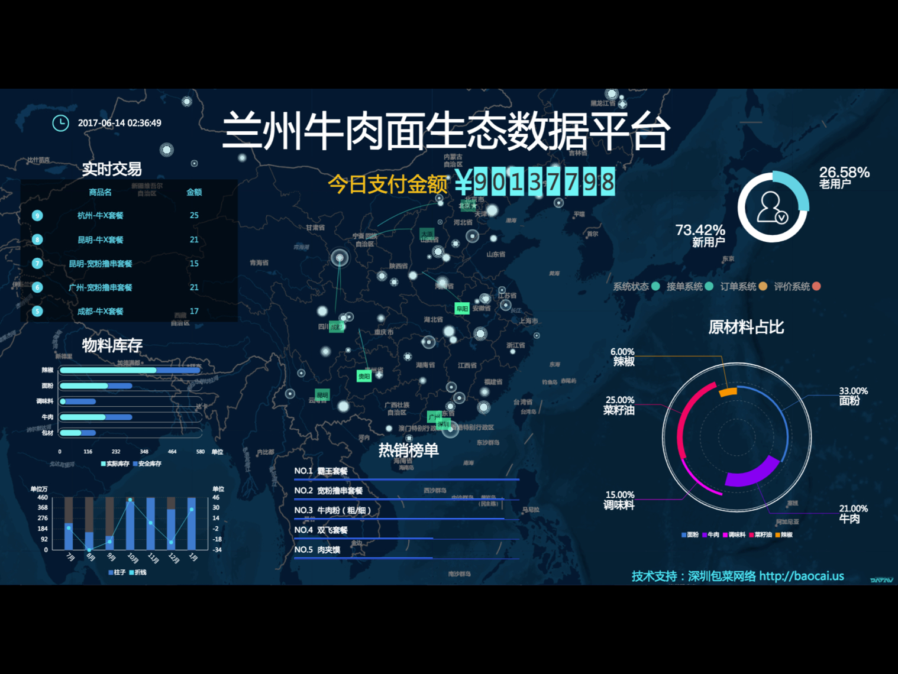
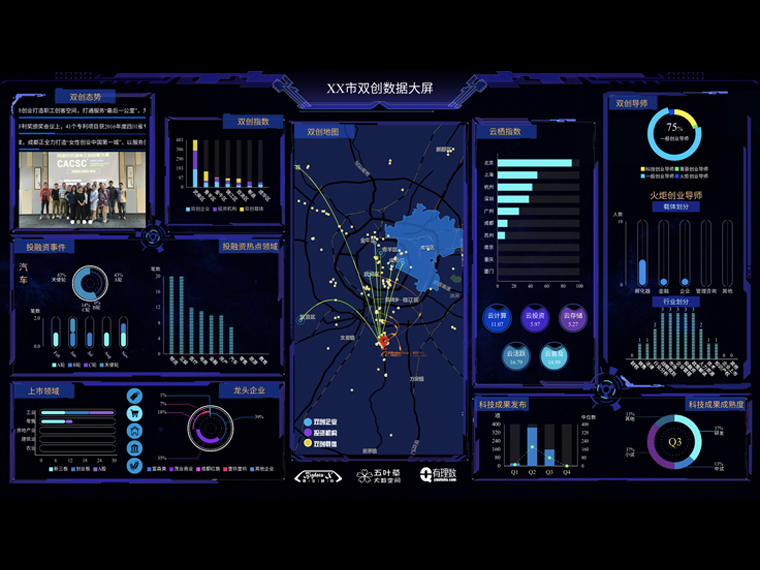

在数据可视化展示系统中，地理信息系统（GIS）组件已经几乎是必备的标配了。

GIS组件通过地图的形式直观地展现数据项在地理上的分部，以地图上点标注（Marker）的颜色、大小等表示数据量。在可交互系统中，还可通过点击点标注弹出或跳转详情页面，或实现各种LBS（基于位置的服务）。

GIS组件往往位于展示大屏主页面的中心位置，或作为整体背景，例如以下两图（图片来自阿里云DataV官网），其重要性可见一斑。

在通用的数据可视化系统中，我们可以使用[高德地图](http://lbs.amap.com/)或[百度地图](http://lbsyun.baidu.com/)等第三方平台提供的API或SDK，实现所需的GIS组件。

最近在做工业云的平板客户端，其中就有GIS系统的需求，该GIS系统是作为管理工程项目的导航入口，通过地图上的点标注反映用户所拥有项目的地理位置，可点击选择弹出详情组件和进入管理页面。

与数据可视化大屏中的GIS系统比较，除了常见的要求外，要着重注意两点：

- 由于是工业云的客户端而非定制的展示系统，用户项目的数量、分布千差万别，可能只有同城的几个项目，也可能分布全国的几百个项目，或者可能有海外项目。
- 该系统最主要的目标是作为管理工程项目的导航入口，因此更注重交互体验，不管是持有多少项目的用户，都希望有一个便捷的方式方便其聚焦选择所需项目。

#Web vs Native