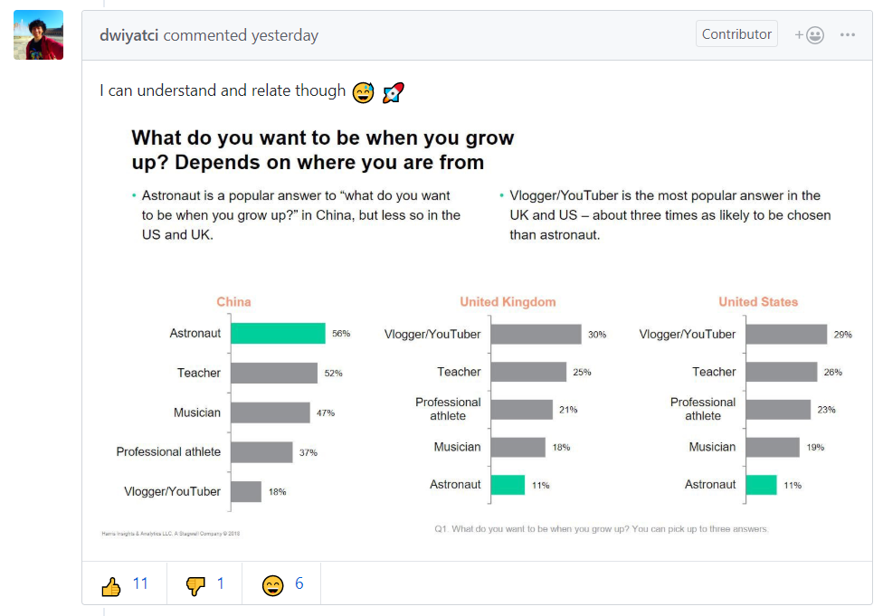

> 埃文斯对太空中准备登月的宇航员说：“今早(7月20日)有关阿波罗的头号标题，就是请你们(在月球)注意一位带着大兔子的可爱姑娘。古老的传说称，一个名叫嫦娥的中国美女已经在那里住了4000年。”

最近，为纪念阿波罗11号登月50周年，一位名叫 Chris Garry 的用户上传了阿波罗11号项目的部分源代码。这些代码从 MIT 科学博物馆的印刷本电子化图片抄录改编而来，并由两位 MIT 科学家 Paul Fjeld 和 Deborah Douglas 完成整理： [chrislgarry/Apollo-11](https://github.com/chrislgarry/Apollo-11) 。

但此事却引起了一些波澜，一些中文的“玩梗”性质的 issue 出现在了项目中，使得该项目 issue 区的前几页俨然成了中文论坛的灌水区。

对于这一现象，国内很多科技媒体迅速进行了报道，主旨普遍是批评中国程序员素质低的，有的甚至在标题中用上了“丢人现眼”这样严厉的词汇（ [丢人现眼……GitHub阿波罗11号代码仓库惨遭中文灌水](https://www.qbitai.com/2019/07/5370.html) ）。

那么事情到底是怎样的呢，中国程序员是否真的”丢人现眼“了呢？

该项目的所有者 Chris Garry 7月20日发起了一个 [issue](https://github.com/chrislgarry/Apollo-11/issues/485) ：

>Im currently working on the best way to deal with recent influx of issues. It seems there arent any features for dealing with this problem in bulk, so I submitted a feature request to bulk flag/delete in the UI (pretty sure it can be done using the API via a simple python script) and to limit issue creation etc. to accounts older than age X. Ill close this once we have a long-term solution. Unfortunately, those who want to watch our repository are being bombarded with nonsense notifications, so this is important. **Its important to note that most of these issues are jokes which are ok, but this could become problematic if it gets out of hand**.

他确实提到了 "being bombarded with nonsense notifications" ，并且希望能够找到批量处理 issue 的办法，但注意最后加粗的一段， Chris Garry 似乎是接受这些 jokes 的，目前只是担心或防止它们会失控。

下面他的这段 [评论](https://github.com/chrislgarry/Apollo-11/issues/485#issuecomment-513519612)  则更明确的说明了他的态度：

> **dont worry, joking is ok!** We get a lot of joke issues from English speakers as well. But if the issues contain violence, hate speech, etc, towards others, then we have to try to keep it peaceful. **Although it is hard for us to know which issues in Chinese are jokes and which are hateful speech, because we dont speak Chinese.**

从第一句话的语气我们可以看出， Chris Garry 对玩梗的态度甚至是欢迎的，他提到英文的 issue 很多也是玩梗的，只是由于他不懂中文，所以会觉得 "nonsense" ，他反对的是“仇恨言论”，困扰他的是他不懂中文所以不能甄别出其中的仇恨言论。

事实上， [chrislgarry/Apollo-11](https://github.com/chrislgarry/Apollo-11) 是一个以纪念意义为主的项目，代码50年前就已经 archive 了，它的 issue 区基本上已经不存在“严肃的技术讨论”这样的需求了，这一点与去年的“ deno 学不动”事件是有本质区别的。我大致翻了一下，诚如 Chris Garry 所言，之前英文的 issue 除了零星的几个“ XX 页少了逗号”算是“技术讨论”外，也都是类似的玩梗，[比如这个](https://github.com/chrislgarry/Apollo-11/issues/373) 。毕竟能对航天制导的代码谈笑风生的人应该不会天天泡 GitHub （这是一个玩梗）。

至此，我们已经理清了项目的所有者 Chris Garry 的态度。那么到底哪些人是善意的玩梗，哪些人在发布“仇恨言论”呢？

就目前的40多个中文 issue 来看，玩梗的发起者往往言论比较善意，有些玩梗甚至还挺具有解构的深度的，[比如这个](https://github.com/chrislgarry/Apollo-11/issues/434#issuecomment-513128492) ，一唱一和间调侃了中国底层程序员的辛酸， Chris Garry 如果能看懂中文估计也会点个赞吧。

反而是很多站在道德制高点职责玩梗的人用词欠妥：[问候父母](https://github.com/chrislgarry/Apollo-11/issues/482#issuecomment-513428383) 、[人身攻击](https://github.com/chrislgarry/Apollo-11/issues/482#issuecomment-513428821) 、[查户口](https://github.com/chrislgarry/Apollo-11/issues/482#issuecomment-513441762)。他们用词的粗鄙程度与他们的道德制高点形成鲜明极强的反差，令人困惑。

---

国外程序员对该项目出现很多中文issue有自己的看法，不过他们的关注点是和中文媒体、道德职责者完全不同的：

该项目的 contributor 之一 dwiyatci 认为出现这么多中文 issue 说明中国人更关注航天领域。他举出了一个调查结果，显示中国年轻人最想成为宇航员，而欧美青年最想成为网红，言下之意中国科教兴国是主流，欧美则反智横行。这与很多中国人的刻板结论恰好完全相反。

---

中国的程序员正在逐步走向世界，这一过程不可避免有些步履蹒跚。但从该项目中 Chris Garry 、 dwiyatci 的态度以及之前微软员工对 996icu 的支持等事件，可以看出，纵容有语言上的障碍，国外的程序员对中国的程序员的这些声音，态度是欢迎、支持、尊重的。因此我们中国程序员在遵守基本规则道德的前提下，也不用妄自菲薄、如履薄冰。

你讲的梗，别人也会会心一笑。