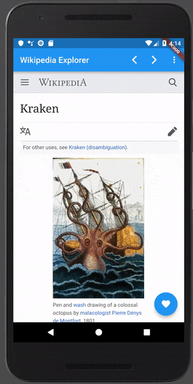
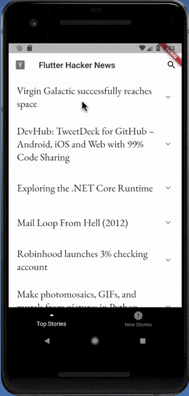
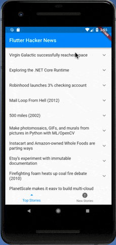
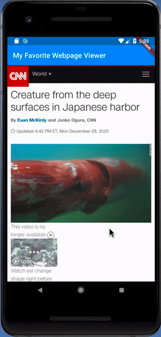
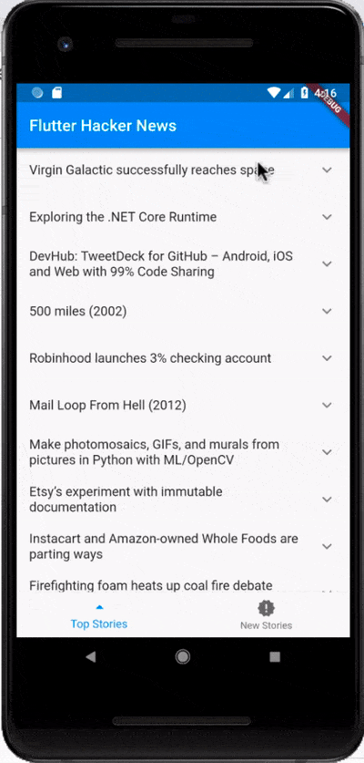

> [flutter_echarts](https://github.com/entronad/flutter_echarts) 深度的依赖 Flutter 团队的官方 WebView 插件，本文介绍了此 WebView 插件，特别是提了 WebView 中 Controller 、手势捕获、key等几个问题，比较突出重点，文中的示例项目也比较好，值得一看。
>
> 原文：[The Power of WebViews in Flutter](https://medium.com/flutter/the-power-of-webviews-in-flutter-a56234b57df2) 

你是否想要在 app 开发这样的功能：无需打开手机自带的浏览器就可以展示网页？或者你已经在网站上实现了一套安全的支付流程，不想再在移动端重写一遍——毕竟付款是个敏感的业务，你可不想一半的钱最后都意外落到“保护[海怪](https://en.wikipedia.org/wiki/Kraken)基金会”了。只有我一个人这样想吗？终于， Flutter 团队创建了一个 [非常好用的插件](https://pub.dev/packages/webview_flutter) ，让你能在 app 中引入 WebView 实现这些功能。

“这些功能”我指的是在 Flutter app 中展示网页……不是指保护海怪。

# Flutter WebView 和其它 Widget 一样

在你的 app 中引入 WebView 插件非常简单。它用起来就和其它的 Widget 一样：`WebView(initialUrl: ‘https://flutter.io')` 。你也可以通过 `javascriptMode` 参数启用或禁用 JavaScript。默认情况下你的 WebView 中的 JavaScript 是禁用的，所以要想启用的话你需要这样创建 WebView ：

```
WebView(
  initialUrl: 'https://flutter.io',
  javascriptMode: JavascriptMode.unrestricted,
)
```

几乎所有获取 WebView 信息以及控制 WebView 的功能是通过这样东西实现的： WebViewController 。当 WebView 完全创建好后，它通过一个回调函数返回：

```
WebViewController _controller;
WebView(
  initialUrl: 'https://flutter.io',
  onWebViewCreated: (WebViewController webViewController) {
    _controller = webViewController;
  },
);
//...later on, probably in response to some event:
_controller.loadUrl('http://dartlang.org/');
```

WebViewController 是你通过 Flutter 程序修改 WebView 或者获取其参数（比如当前 URL ）的门票。为了说明这实践上是怎样操作的，我写了一个简单的维基百科浏览 app ，它能让你记录并查看书签，这样完美主义者就永远不会因为忘了上次看过某篇文章而掉进“ [维基兔子洞](https://en.wikipedia.org/wiki/Wiki_rabbit_hole) ”了。



Wiki-rabbit-hole-browser 完整的代码参见 [GitHub](https://github.com/efortuna/wiki_browser) 。

WebView 和其它所有的 Flutter Widget 一样，上面可以添加覆盖其它 Widget。值得注意的是点赞按钮就是一个普通的 `FloatingActionButton` 悬浮在 WebView 上面，它有常见的悬浮阴影效果。另外，当app bar上的下拉菜单打开时，它会和对其它 Widget 一样部分遮住 WebView。

如果你看代码，会发现在示例中，我非常多的使用 `Compliter` 类和 `FutureBuilder` 。将 `_controller` 实例变量声明为 Completer 类似于为 WebViewController 设置了一个占位符。我们可以通过调用 _controller.isCompleted （意思是当我们有可用的 WebViewController 时状态为“完成”）或者 [通过 controller.future 使用 FutureBuilder](https://github.com/efortuna/wiki_browser/blob/master/lib/main.dart#L40) 来检查是否有可用的 WebViewController 。使用 FutureBuilder 能让我们创建的 UI 组件比如 FloatingActionButton 仅在有可用的 WebViewController 时添加点赞（否则的话程序在保存点赞时将无法得到 `currentUrl` ）。

WebView 的另外两个特性稍微有点复杂，所以我们将在下面两部分详细看一下。

---

# WebView 也可以捕获特殊的手势

作为 Flutter Widget，WebView也可以参与到 Flutter 的手势消歧协议（ [被称为 Gesture Arena](https://flutter.dev/docs/development/ui/advanced/gestures#gesture-disambiguation) ）中。默认情况下，WebView 只会对没有被其它 widget 声明的手势做出响应。不过你也可以通过指定 `gestureRecognizers` 来使它主动声明一个手势。

如果你的 WebView 在其它会对手势做出反应的 Widget 中，比如一个 ListView，你可能想要指定 app 如何对手势做出响应。当用户手指拖动屏幕时，是应该滚动 ListView 还是 WebView ？如果你希望两个 widget 都能滚动，WebView widget 可以 “捕获” 拖动的手势，这样当用户拖动 WebView 时它会滚动，而不是 ListView 滚动。你可以通过 `gestureRecognizers` 参数指定哪些手势传递给 WebView widget 。这个参数为所有你想捕获的 GestureRecognizer 的 Set 。不要被那个工厂对象吓着了，它只不过是一个美化的 builder 方法。要捕获垂直滚动事件，可以这样写：

```
WebView(
  initialUrl: someUrl,
  gestureRecognizers: Set()
    ..add(Factory<VerticalDragGestureRecognizer>(
      () => VerticalDragGestureRecognizer())),
)
```

或者：

```
var verticalGestures = Factory<VerticalDragGestureRecognizer>(
  () => VerticalDragGestureRecognizer());
var gestureSet = Set.from([verticalGestures]);
return WebView(
  initialUrl: someUrl,
  gestureRecognizers: gestureSet,
);
```

如果你完整的看过 [Boring Flutter Development Show](https://www.youtube.com/playlist?list=PLOU2XLYxmsIK0r_D-zWcmJ1plIcDNnRkK) ，你应该看过我们开发 Kraken News，即 *Hacker* News Reader App 。



为了演示 app 上下文中的手势捕获，我将 Hacker News app 改为部分网页作为“预览”展示。让用户垂直滚动链接的页面来决定是否在单独的新页面中打开进行深度阅读。



Hacker News reader app 的代码见 [这个 repo](https://github.com/efortuna/hn_app/blob/master/lib/main.dart) （这里展示 `_buildItem`）。

然而，如果这个 WebView 所在的 widget 只捕获到你不关心的手势，则不需要 gesture detector 。比如，一个 PageController 只响应水平拖动手势，你希望 WebView 能够垂直滚动，你可以这样写：

```
PageView(children: [
  WebView(initialUrl: urlOne),
  WebView(initialUrl: urlTwo),
  WebView(initialUrl: urlThree),
]));
```



# 你的 WebView 也许需要一个参数 key

你也许已经见识过 Flutter 代码构造函数中无处不在的可选参数 key 了。当你的 app 中有多个同类型的  stateful widget 需要移除、添加、重载时就需要 key 。如你所见，WebView 是 stateful widget （状态包括当前页面和浏览器历史）。所以如果你的 app 中有多个 WebView ，你可能需要添加参数 key。

Hacker News app 中就有这样的一个例子！这是在没有 key 的情况下切换标签会发生的情况：



可以看到，当切换标签，标题 “Interview with Alan Kay” 展开了，但是 webview 还是显示的 BBC 关于 Virgin Galactic 的页面！给最顶层的集合 widget 添加 key 可以修复这个问题（此例中为 `ExpansionTitle`）：


关于 key 如何能解决这个问题的简单解释是当 Flutter 切换 展示的文章列表时，看起来每套文章都是由包含 ExpansionTitle 项的 ListView 构成。Flutter 有一个快速比对算法检查 widget 的类型和 key 以避免不必要的屏幕重绘。如果没有 key，由于每个列表的所有 widget 类型都一样，stateless 项（比如标题链接）全都会更新，但 statefull 组件，（比如 ExpansionTitle 的展开状态和网站的 URL）不会重绘。添加 key 可以解决这个问题。

类似的，如果你在 [Hero](https://flutter.io/docs/development/ui/animations/hero-animations) widget 的上下文中使用 WebView，你需要一个全局 key，让 Flutter 知道这两个 WebView 实际上是一样的而不需要重新渲染第二个。

# 还有几件需要记住的事情

在我们添加了波兰语之后，当前 WebView 插件还处在开发者预览阶段，也就是说如果你想在 iOS 上使用 webview 插件，需要在 `ios/Runner/Info.plist` 的 `<dict>` 中添加：

`<key>io.flutter.embedded_views_preview</key><string>yes</string>` [正如这个 GitHub issue 所说的](https://github.com/flutter/flutter/issues/19030#issuecomment-437534853)

还有一个社区提供的 WebView 插件，但它没有 Flutter 团体提供的以上插件的全部功能。它只是简单的在一个 native view 中展示网页，并没有集成到 Flutter widget 树中。所以它不允许将 WebView 与其它任何的组件组合。使用本文描述的 [webview_flutter 插件](https://pub.dartlang.org/packages/webview_flutter) 可以避免这一问题。

谢谢大家！把 WebView 添加到你的 Flutter app 中吧。同时也给海怪一些爱。

