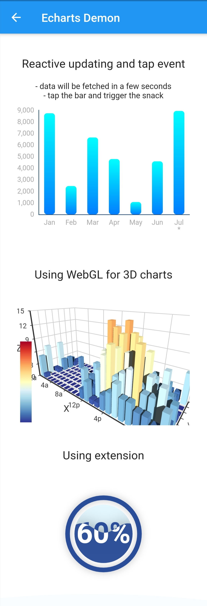
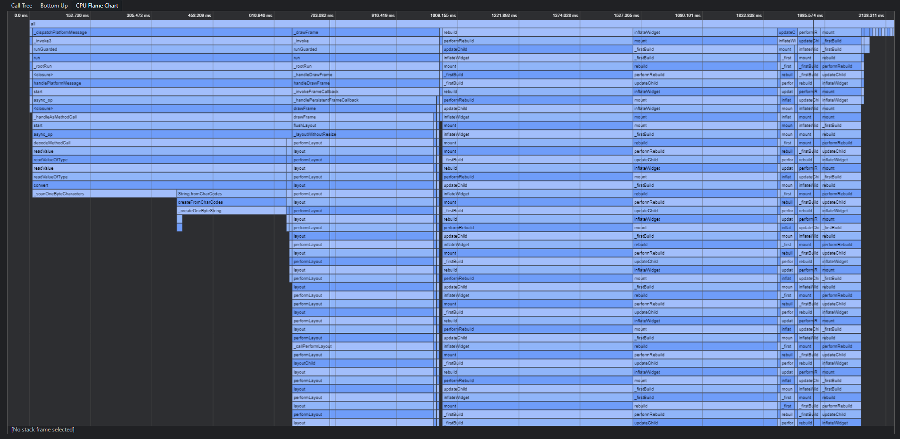
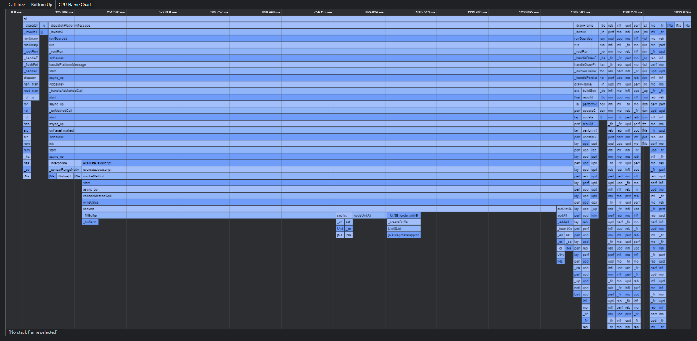
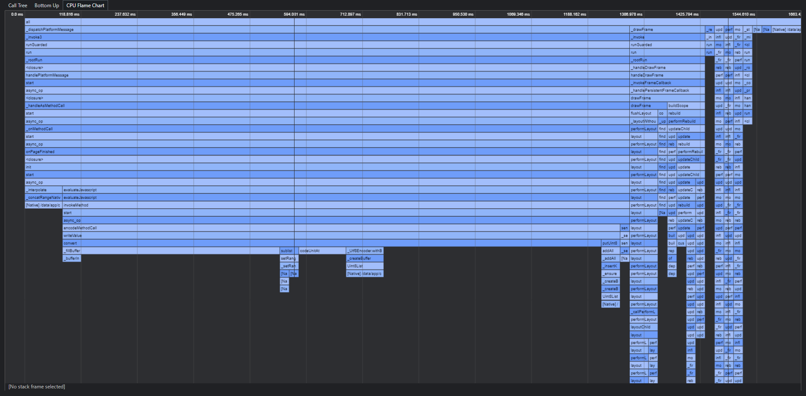
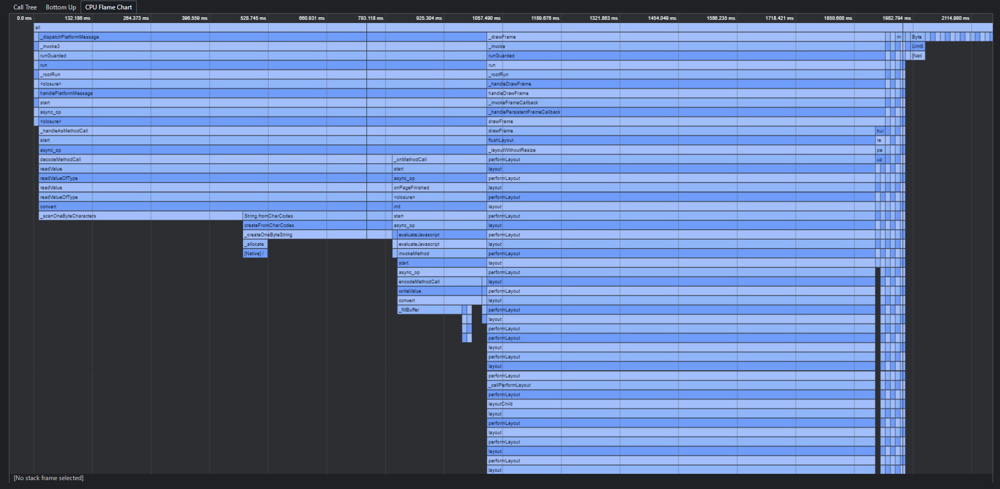

> 本文记录了基于 WebView 的 Flutter 可视化库：[echarts_flutter](https://github.com/entronad/flutter_echarts) 的一次优化加载性能的过程。

对于任何基于 WebView 的组件，html 的加载都是关乎性能的一个重要环节。 [echarts_flutter](https://github.com/entronad/flutter_echarts) 的基本原理是用 WebView 渲染本地的 echarts 图表，因此也不例外。

[echarts_flutter](https://github.com/entronad/flutter_echarts) 的 WebView 加载主要涉及以下几个部分：

- 模板 HTML
- echarts 脚本
- echarts 扩展脚本
- 图表逻辑代码

其中模板 html 和图表逻辑代码的体量很小，重点是 echarts 本体及扩展脚本加载。

Echarts 最强大的功能之一，就是具有很多功能强大的扩展，比如 WebGL 3D图表、Map 地图组件，在数据可视化要求越来越高的今天，这些扩展几乎成了和本体一样重要的部分，因此允许用户方便的引入扩展是一个必不可少的功能。此外为了避免麻烦的 asset 管理，我们希望无论是 HTML 还是 JavaScript 脚本，都能以字符串的方式处理，即 WebView 加载统一资源定位符（URI）。

因此这其中就有以下几个问题：

- 脚本的加载时机是直接放在 HTML 中还是后期插入
- URI 对一些特殊字符有限制，需要安全的编码方式

最初的时候，方案是这样考虑的：按照一般理解内容尽量都放在 HTML 中一次加载是最好的。考虑到 JavaScript 脚本中有大量的 URI 限制字符，组装完 HTML 后转换成 Base64 编码。由于事先不知道用户引入的脚本，编码转换通过函数动态完成：

```
String _getHtml(
  String echartsScript,
  List<String> extensions,
  String extraScript,
) {
  ... // 拼接并返回所有 HTML 和脚本
}


  @override
  void initState() {
    super.initState();
    // 初始化的时候进行 Base64 转换
    _htmlBase64 = 'data:text/html;base64,' + base64Encode(
      const Utf8Encoder().convert(_getHtml(
        echartsScript,
        widget.extensions ?? [],
        widget.extraScript ?? '',
      ))
    );
    _currentOption = widget.option;
  }


  @override
  Widget build(BuildContext context) {
    return WebView(
      // 加载所有内容
      initialUrl: _htmlBase64,
      ...
    );
  }
```

# 性能测试

为进行性能分析，进行一个简单初步的性能测试。用例是加载三个图表，其中第二个引入了 WebGL 渲染 3D 的图表，第三个引入带动画的水球图：



利用 Flutter Dev Tool 中的 CPU 火焰图，可以看到时间占用如下：



# 性能优化

Echarts 本体和很多扩展的脚本体积都非常大，在运行时拼接字符串和编码转换无疑都是很耗时的，但是通过 URI加载的话为保证合法又是必要的，如何解决这个矛盾呢？

不如舍弃“一次全部加载”的想法，把不定的、动态的部分通过 `evaluateJavascript` 函数插入，无需编码转换；把确定的、静态的事先转码好直接加载。

为此，先做个实验，其他条件都不动，仅把所有的脚本（Echarts 本体、扩展）移出 HTML ，用 `evaluateJavascript` 函数插入，看性能变化如何：

```
  @override
  void initState() {
    super.initState();
    _htmlBase64 = 'data:text/html;base64,' + base64Encode(
      const Utf8Encoder().convert(_getHtml(
        // 将编码转换中传入的所有脚本去掉
        // echartsScript,
        // widget.extensions ?? [],
        // widget.extraScript ?? '',
      ))
    );
    _currentOption = widget.option;
  }
  
  
  void init() async {
    final extensionsStr = this.widget.extensions.length > 0
    ? this.widget.extensions.reduce(
        (value, element) => (value ?? '') + '\n' + (element ?? '')
      )
    : '';
    await _controller?.evaluateJavascript('''
      // 改在页面加载完成后注入
      $echartsScript
      $extensionsStr
      const chart = echarts.init(document.getElementById('chart'), null);
      ${this.widget.extraScript}
      chart.setOption($_currentOption, true);
    ''');
  }
```

结果如下：



可以看到，加载部分的耗时减少了，而包含插入脚本的 `onPageFinished` 函数耗时增加了，总耗时减少了不少。

看来对大段字符串的编码转换确实性价比低，改用 `evaluateJavascript` 函数插入是个可行的方向。

这样我们再把所有的动态编码逻辑去掉，模板 HTML 直接以常理字符串加载。而且由于现在的 HTML 静态、简短，我们可以手动转换非法字符，直接传入 UTF-8 编码，这样我们的组件就无需引入 dart:convert 库了，而且源码更直观。

```
const htmlUtf8 = 'data:text/html;UTF-8,<!DOCTYPE html><html><head><meta charset="utf-8"><style type="text/css">body,html,%23chart{height: 100%;width: 100%;margin: 0px;}div {-webkit-tap-highlight-color:rgba(255,255,255,0);}</style></head><body><div id="chart" /></body></html>';


  @override
  void initState() {
    super.initState();
    _currentOption = widget.option;
  }
  
  @override
  Widget build(BuildContext context) {
    return WebView(
      initialUrl: htmlUtf8,
      ...
    );
  }
```

这样测试结果如下：



可以看到，耗时又有进一步的减少，主要体现在加载部分。

这样相对于最初的时候，性能提升还是比较大的。


Echarts 本体的脚本也是确定的、静态的，如果把它事先放在HTML里，并事先转好码呢：

```
const echartsHtmlBase64 = '...';

  
  @override
  Widget build(BuildContext context) {
    return WebView(
      initialUrl: echartsHtmlBase64,
      ...
    );
  }
```

结果如下：



相比之前优化的结果耗时反而更多了。

可见“脚本放在 HTML 中“并不一定比” `evaluateJavascript` 函数插入”好，甚至由于编码等原因，反而可能更耗时。

# 结论

综上，最终的优化方案就采用：模板 HTML 以UTF-8 URI 字符串的形式加载，所有脚本和逻辑代码以 `evaluateJavascript` 函数插入。