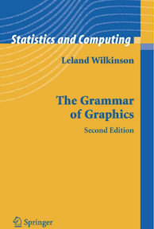
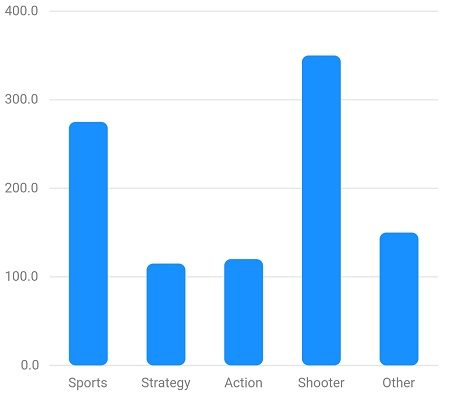
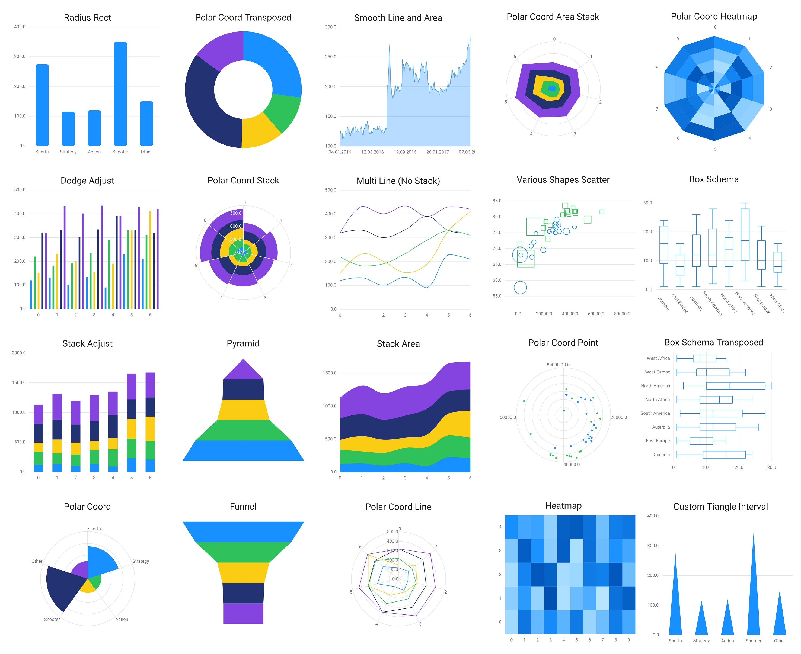

> 本文介绍了一个基于图形语法（Grammar of Graphics）的 Flutter 可视化库：[Graphic](https://github.com/entronad/graphic)
>
> [Repository](https://github.com/entronad/graphic)
>
> [pub.dev](https://pub.dev/packages/graphic)

# 背景

数据可视化是应用开发中很常见但很重要的需求，一个好的可视化库能让数据可视化的开发事半功倍。可惜的是，目前在 Flutter 社区中，还没有一个完美的可视化库。目前的 Flutter 可视化库都存在一些不尽如人意的地方，例如：

[charts_flutter](https://pub.dev/packages/charts_flutter) 由 Google 内部开发，代码质量很高。但是它提供的图表种类很少，仅有最常见的线图、柱状图、饼图等几种，且没有曲线平滑等常用的功能。此外它似乎是一个实验性质的项目，没有任何的文档或介绍，虽然源代码放在了GitHub上，但明确表示不会处理任何 issue 和 PR，似乎也好久没有特性更新了。

[fl_chart](https://pub.dev/packages/fl_chart) 是 pub.dev 上目前人气最高的可视化库，它有较为酷炫的设计和动画，是一位 [伊朗帅哥](https://github.com/imaNNeoFighT) 开发的。但是它的个人风格太明显了，不太适用于统计或严肃的场景。

[syncfusion_flutter_charts](https://pub.dev/packages/syncfusion_flutter_charts) 较为完善和专业，但它是一个闭源的商业软件，对于很多开发者来说并不适合。

为了构建复杂的可视化图表，我们做过 [flutter_echarts](https://github.com/entronad/flutter_echarts) ，通过 Webview 的方式将 Web 中的 Echarts 引入到 Flutter App 中，满足很多复杂的可视化需求，但是 Webview 在性能和兼容性等方面还是存在诸多问题，对于性能和稳定性要求高的图表，还是需要一个 Flutter 原生的可视化方案。


近年来，前端的数据可视化也有了长足的发展，图形语法（Grammar of Graphics）的理论逐渐被应用到了前端可视化库中。图形语法是 Leland Wilkinson 在其所著的《The Grammar of Graphics》一书中提出的理论，该理论是一套用来描述所有统计图形深层特性的语法规则。



基于图形语法的理念，可视化库就不用受到饼图、线图、柱状图这样传统分类的限制，将数据可视化抽象成不同的图形标记、坐标系、度量的组合，大大提升了可视化库的扩展性和灵活性。应用图形语法的前端可视化库有 [vega](http://vega.github.io/) 系列、阿里的 [AntV](https://antv.vision/) 系列、微软的 [chart-part](https://microsoft.github.io/chart-parts/) 等。


基于以上的背景，诞生了 [Grapphic](https://github.com/entronad/graphic)：一个基于图形语法的 Flutter 可视化库。

# 示例

一个简单的示例：



 ```dart
 Chart(
   data: [
     { 'genre': 'Sports', 'sold': 275 },
     { 'genre': 'Strategy', 'sold': 115 },
     { 'genre': 'Action', 'sold': 120 },
     { 'genre': 'Shooter', 'sold': 350 },
     { 'genre': 'Other', 'sold': 150 },
   ],
   variables: {
     'genre': Variable(
       accessor: (Map map) => map['genre'] as String,
     ),
     'sold': Variable(
       accessor: (Map map) => map['sold'] as num,
     ),
   },
   elements: [IntervalElement()],
   axes: [
     Defaults.horizontalAxis,
     Defaults.verticalAxis,
   ],
 )
 ```


更多示例请参考 [Example App](https://github.com/entronad/graphic/tree/master/example) ：



# 特性

**图形语法**

所谓数据可视化，可以粗略的概况为：将数据通过某种规则转换为对应图形的视觉通道属性（颜色、形状、大小、位置等），然后将具有这些属性的图形渲染出来。这一过程在图形语法中具体表现为：


在 Graphic 的实现上，接口和类名的设计主要参考了 AntV。核心概念如下：

- **Geom**：几何标记，组成图表的几何图形
- **Coord**：坐标系，图表的坐标系，目前有笛卡尔坐标系（Rect）和极坐标系（Polar）
- **Scale**：度量，将数据缩放到 [0, 1] 的区间，以便映射到视觉通道属性
- **Attr**：视觉通道属性，包括位置、颜色、形状、大小等，值由经过度量变换的数据决定，被应用到几何标记上

这些概念对于了解图形语法的人，特别是使用过 AntV 的人应该不陌生，如果没有接触过可以参考 AntV 的[文档](https://www.yuque.com/antv/g2-docs/tutorial-the-grammar-of-graphics) 。我们认为图形语法将会是未来数据可视化发展的大方向，不管现在是否使用相关的可视化库，图形语法都是值得学习了解的。

**声明式图表**

Web 生态中的大部分可视化库都是命令式的，绘制图表通过语句调用一系列函数实现，AntV 也不例外。但 Flutter 中推崇的是声明式、响应式的视图。通过 build 函数返回值中树状的参数结构配置视图的结构。值得一提的是这也是 Web Canvas 和 Flutter CustomPaint 组件的重要差别。

因此 Graphic 的接口设计也采用了声明式的，通过 graphic.Chart 组件的参数对所有信息进行配置，当视图的组件树更新时图表自动重新绘制。当然，后期会对重绘进行一些优化。

**自定义 Shape**

图表之所以分门别类、变化万千，最主要的就是形状这一属性的多样。因此在所有视觉通道中，形状也是最复杂的，形状的可定制化程度决定了可视化库的扩展性。

Graphic 中形状 Shape 这一属性的类型是可自定义的类，传入几何标记各视觉通道的属性值，组合出图形对象，供渲染引擎使用。用户可自己编写子类的实现，即自定义的 Shape。

```
class TriangleShape extends IntervalShape {
  @override
  List<Figure> renderGroup(
    List<Aes> group,
    CoordConv coord,
    Offset origin,
  ) {
    ...
  }

  @override
  List<Figure> renderItem(
    Aes item,
    CoordConv coord,
    Offset origin,
  ) {
    ...
  }

  @override
  bool equalTo(Object other) => other is TriangleShape;
}
```

