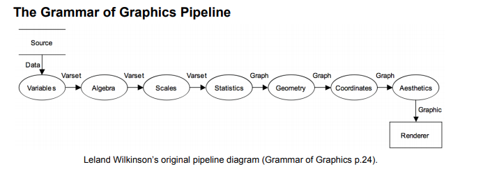
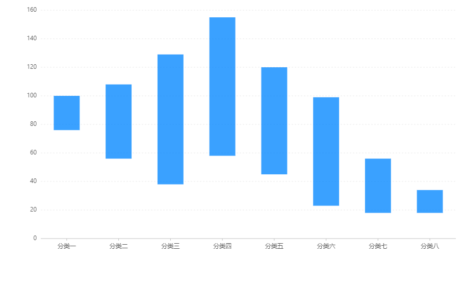

> 基于图形语法的 Flutter 可视化库：[Graphic](https://github.com/entronad/graphic)

图形代数（graphics algebra）是图形语法的灵魂之一，但遗憾的是除了 [GPL](https://www.ibm.com/support/knowledgecenter/SSLVMB_sub/statistics_reference_project_ddita/gpl/gpl_intro_algebra.html) 外好像还没有看到哪个图形语法可视化库实现了**真正的**图形代数。Graphic 中目前的图形语法也是形同虚设的，只是简单通过” \* “符号连接字段名，本质上只是个字段名数组，在各 Shape 中预置对此数组的按序处理。

作为一个开发者，能切身体会图形代数被舍弃的原因：它由众多抽象晦涩的概念和联系构成，哪怕对其中的一点没有理解，也不禁让你怀疑它能否满足可视化库的各种需求。不过图形代数经受了 GPL 的考验，Wilkinson 本人也充满信心。作为图形语法的灵魂之一，值得深入研究。

以下记录我对图形代数的几点思考：

# 表达式的输入输出

在图形语法中，variable 是个很重要的概念，它的定义是：对象（object）的集合、值（value）的集合、以及从对象到值的映射；与之对立的是 varset (variable set) 的概念，它的定义是值的集合、对象的集合、以及从值到集合的对象，映射关系刚好反转。

可见 variable 和 varset 具有一一对应的关系。

图形代数的表达式由操作数（symbol）和连接它们的操作符（operator）组成。操作数就是由 varset 来担任的。varset 在图形语法的流程中担任了重要角色：



不过个人感觉，由于 variable 和 varset 的一一对应的关系，认为操作数指的是 variable 也是可以的。事实上在《图形语法》和 GPL 手册的行文中，也可以看出这种情况：

> Another way of thinking about the algebra is that it identifies the variables you want to analyze in the graph.

图形代数表达式的结果是 frame，是 p 维 varset 的定义域（注意 varset 的定义域是值的集合）的值组成的所有 p 维 tuple 的集合：

> A frame is a set of tuples (x1, ... xp) ranging over all possible values in the domain of a p-dimensional varset. 

将它想象为多维的全空间就可以了。

因此，值得注意的是，图形表达式输入的操作数是 varset，输出结果是 varset 的 tuple。

# 次数与维度

# 有且仅有三种运算符

图形语法中的三种运算符：cross (\*)、nest (/)、blend (+)，是否就能满足所有情况了呢？

以前我认为不能，我们来看一个例子——区间柱状图：



这是 [AntV](https://antv-2018.alipay.com/zh-cn/g2/3.x/demo/column/ranged-column.html) 的一个例子，它的特别之处是对于一个数据 case，它的 position 在 y 维度上要由两个值（记为 `yMin`，`yMax`）确定。那么二维图表中常见的 `x*y`  型的代数定义就不够用了。

AntV 的做法是，将 `y` 定义为这两个值构成的 tuple：

```
var data = [{
  x: '分类一',
  y: [76, 100]
},
...
];
...
chart.interval().position('x*y');
```

这样存在一个问题，从坐标系可以看出，y 维度上的 variable ，类型应当是数值，而代数表达式中的操作数，类型却是数值的元组。这虽然可以通过联合类型等方式判断处理掉，但还是会带来一些困扰。在《图形语法》中，指出代数表达式中的操作数就是 variable 本身。

为避免这种情况，在 Graphic 中目前的处理方式是直接排列出来：`x*yMin*yMax` 。这显然是一种更不合理的方式，完全曲解了 cross 运算符的含义，仅把它作为了一个连接符。

两个不同的 variable 定义在同一维度上，应当考虑的是 blend 运算符：`x*(yMin+yMax)`

由于 `yMin`，`yMax` 表示的是图元的不同位置，代数表达式必须反映出他们的有序性，以便后续 aesthetic 处理。由于对于“+”这个符号的固有印象，我开始认为 blend 也是具有交换性（commutativity）的，其难以表达操作数的顺序。我甚至考虑是不是需要引入一个类似 “-” 这样的运算符，一般代数中减法是没有交换性的，可以表达顺序。

不过后来我发现，Wilkinson 在《图形语法》中指出了，在书的第一版中他也是认为 blend 具有交换性，后来他也意识到对于很多几何元素，在 blend 中也需考虑顺序，因此第二版中重新规定了所有图形代数运算符都不具有交换性：

> The first edition asserted commutativity for the blend operator. This is easy to show for setwise operations in the above notation (the proof is left to the reader). Nevertheless, there are certain geometric elements (path, for instance), that are order-dependent with respect to blend. Rather than place restrictions on blends, we prefer to make graphics algebra noncommutative. Our parser made no use of commutativity, so nothing changes.  

解决了这个疑虑后，我确实相信诚如 Wilkinson 所强调的：图形代数有且仅有三种运算符。

# 图形代数与数据查询语言