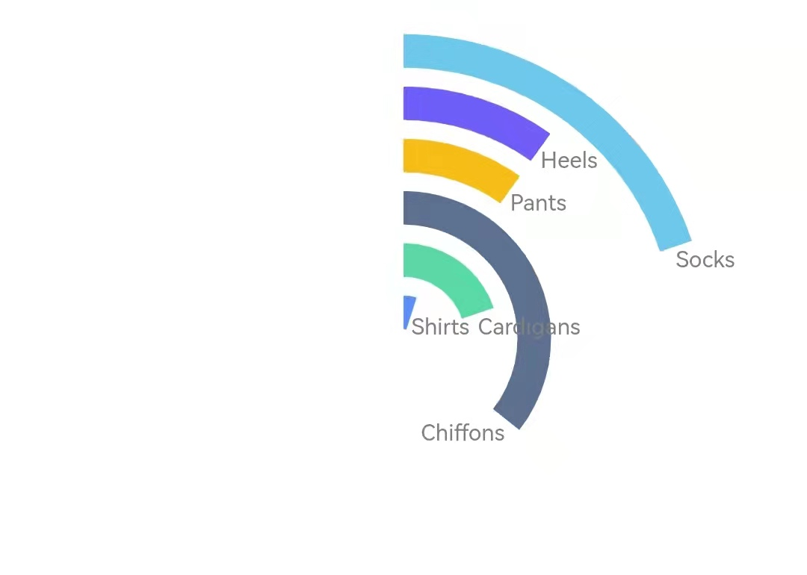
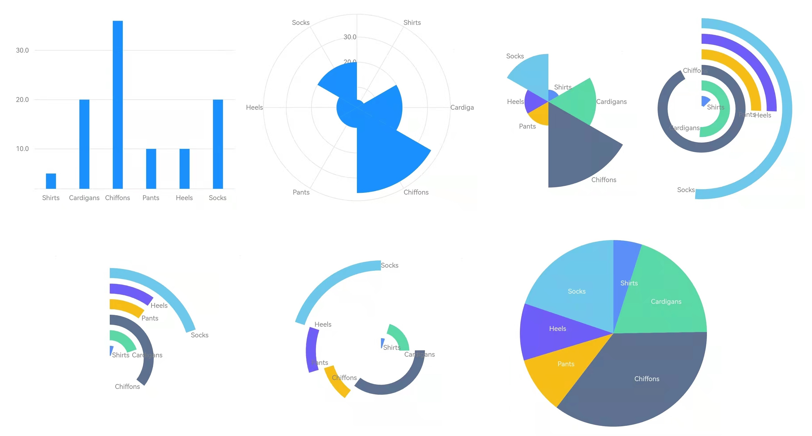

> 在 Flutter 可视化库 [Graphic](https://github.com/entronad/graphic) 的新版本中，优化了声明式定义的语法，使其更好的体现图形语法的本质。
>
> 本文通过 [Graphic](https://github.com/entronad/graphic) 的图形语法定义变换，一步步将柱状图演变为饼图，展示图形语法的灵活丰富。同时也让初学者了解图形语法基本概念。
>
> 如果你从未接触过图形语法，不影响本文的阅读。本文可以看作 [Graphic](https://github.com/entronad/graphic) 的入门教程。

柱状图和饼图都是数据可视化中常见的类型，它们乍一看迥异，但在图形语法中，却有着相同的本质，这是为什么？让我们从柱状图一步步变换成饼图，来了解其中的缘由。

首先从最常见的柱状图开始说起。数据采用和 ECharts 的[入门示例](https://echarts.apache.org/examples/zh/editor.html?c=doc-example/getting-started) 一样：

```dart
const data = [
  {'category': 'Shirts', 'sales': 5},
  {'category': 'Cardigans', 'sales': 20},
  {'category': 'Chiffons', 'sales': 36},
  {'category': 'Pants', 'sales': 10},
  {'category': 'Heels', 'sales': 10},
  {'category': 'Socks', 'sales': 20},
];
```

# 声明式定义

[Graphic](https://github.com/entronad/graphic) 采用声明式定义，所有的可视化语法都在图表组件 [Chart](https://pub.dev/documentation/graphic/latest/graphic/Chart-class.html) 的构造函数中体现：

```dart
Chart(
  data: data,
  variables: {
    'category': Variable(
      accessor: (Map map) => map['category'] as String,
    ),
    'sales': Variable(
      accessor: (Map map) => map['sales'] as num,
    ),
  },
  elements: [IntervalElement()],
  axes: [
    Defaults.horizontalAxis,
    Defaults.verticalAxis,
  ],
)
```

# 数据与变量

图表的数据通过 `data` 字段引入，可以是任意类型的数组。在图表的内部，这些数据项将被转换成标准的 [Tuple](https://pub.dev/documentation/graphic/latest/graphic/Tuple.html) 类型。数据项如何转换为 [Tuple](https://pub.dev/documentation/graphic/latest/graphic/Tuple.html) 中的字段值则由变量（[Variable](https://pub.dev/documentation/graphic/latest/graphic/Variable-class.html)）定义。

从代码可以看出，定义的语法是很简短的，但 `variables` 却占据了一半篇幅。Dart 是一种类型严格的语言，为了能允许任意类型输入数据，详细的 [Variable](https://pub.dev/documentation/graphic/latest/graphic/Variable-class.html) 定义是必不可少的。

# 几何元素

图形语法最重要的特点是区分了抽象的数据图（graph）和具体的图形（graphic）。

比如，数据描述的是一段区间（interval）还是一个单独的点（point），这称之为 graph；而在图上是表现为长条还是三角，多高多宽，这称之为 graphic。生成 graph 和 graphic 的环节分别被称之为几何（geometry）和具象（aesthetic）。

Graph 和 graphic 的概念，触达了数据与图形之间的本质关系，是图形语法跳出了传统图表分类束缚的关键。

而承载这两者定义称为几何元素（[GeomElement](https://pub.dev/documentation/graphic/latest/graphic/GeomElement-class.html)）。它的类型决定了 graph，分为：

- [PointElement](https://pub.dev/documentation/graphic/latest/graphic/PointElement-class.html) ：点
- [LineElement](https://pub.dev/documentation/graphic/latest/graphic/LineElement-class.html)：点连成的线
- [AreaElement](https://pub.dev/documentation/graphic/latest/graphic/AreaElement-class.html)：线之间的区域
- [IntervalElement](https://pub.dev/documentation/graphic/latest/graphic/IntervalElement-class.html)：两点之间的区间
- [PolygonElement](https://pub.dev/documentation/graphic/latest/graphic/PolygonElement-class.html)：分割平面的多边形

柱状图的柱高，表现的是 0 到数据值这段区间，因此选用 [IntervalElement](https://pub.dev/documentation/graphic/latest/graphic/IntervalElement-class.html)。这样，我们就得到了最常见的**柱状图**：


回到开头的问题，饼图的张角也是表达一个区间，应当也属于 [IntervalElement](https://pub.dev/documentation/graphic/latest/graphic/IntervalElement-class.html)，但为什么柱状图是条形，饼图是扇面？

# 坐标系

坐标系将不同的变量分配到平面上不同的维度中。对于直角坐标系（[RectCoord](https://pub.dev/documentation/graphic/latest/graphic/RectCoord-class.html)），维度分别是水平和垂直，对于极坐标系（[PolarCoord](https://pub.dev/documentation/graphic/latest/graphic/PolarCoord-class.html)），维度则分别是角度和半径。

目前示例中没有指明 `coord` 字段，所以坐标系是默认的直角坐标系。既然饼图是通过张角表达区间，那应当使用极坐标系。我们添加一行定义指定使用极坐标系：

```dart
coord: PolarCoord()
```

则图形变为**玫瑰图**：


似乎开始接近饼图了。不过这个“一键切换”得到的图形还很不完善，需要一些处理。

# 度量

第一个问题是，扇面半径的比例，似乎和 `sales` 数据的比例不一样。

处理这个问题，就涉及到图形语法中的一个重要概念：度量（[Scale](https://pub.dev/documentation/graphic/latest/graphic/Scale-class.html)）。

原始数据的值可能是数值、字符串、时间。即使同为数值，尺度也可能相差好几个数量级。因此图表使用它们前，需要将其标准化，这个过程就称之为度量。

对于连续型的数据，比如数值、时间，要将它们归一化到 `[0, 1]` 上；对于离散型的数据，比如字符串，要将它们映射到 0, 1, 2, 3... 这样的自然数索引。

每个变量都有一个对应的度量，在 [Variable](https://pub.dev/documentation/graphic/latest/graphic/Variable-class.html) 的 `scale` 字段中设置。[Tuple](https://pub.dev/documentation/graphic/latest/graphic/Tuple.html) 中的变量值可能是数值（`num`）、时间（`DateTime`）、字符串（`String`）三者之一，因此度量根据处理的原始数据类型，分为：

- [LinearScale](https://pub.dev/documentation/graphic/latest/graphic/LinearScale-class.html)：将区间数值线性归一到 `[0, 1]` 上，连续型
- [TimeScale](https://pub.dev/documentation/graphic/latest/graphic/TimeScale-class.html)：将区间时间线性归一成 `[0, 1]` 上的数值，连续型
- [OrdinalScale](https://pub.dev/documentation/graphic/latest/graphic/OrdinalScale-class.html)：按顺序将字符串映射成自然数索引，连续型

对于数值，默认的 [LinearScale](https://pub.dev/documentation/graphic/latest/graphic/LinearScale-class.html) 会根据图表的数据范围确定区间，因此最小值不一定是 0 。这对于柱状图来说，能让图形很好的聚焦高度差，但对于玫瑰图就不太合适了，因为人们倾向于认为半径反映的是比例关系。

因此，需要手动设置 [LinearScale](https://pub.dev/documentation/graphic/latest/graphic/LinearScale-class.html) 区间的最小值为 0。

```dart
'sales': Variable(
  accessor: (Map map) => map['sales'] as num,
  scale: LinearScale(min: 0),
),
```

# 具象属性

第二个问题是，不同的扇面挨在一起，需要颜色区分一下，而且玫瑰图中人们更习惯用标签而不是坐标轴进行标注。

类似颜色、标签等，人们用来感知图形的，称之为具象属性（aesthetic attribute）。[Graphic](https://github.com/entronad/graphic) 中有如下具象属性类型：

- `position`：位置
- `shape`：具体形状
- `color`：颜色
- `gradient`：渐变色，可代替`color`
- `elevation`：阴影高度
- `label`：标签
- `size`：尺寸

除 `position` 外，每种具象属性在 [GeomElement](https://pub.dev/documentation/graphic/latest/graphic/GeomElement-class.html) 中通过对应的 [Attr](https://pub.dev/documentation/graphic/latest/graphic/Attr-class.html) 类进行定义。通过定义字段的不同，分为以下几种方式：

- 直接通过 `value` 指定属性值。
- 通过 `variable`、`values`、`stops` 指定关联的变量，以及目标属性值，变量值根据类型的不同将被插值或索引映射为属性值。这种属性称为通道属性（[ChannelAttr](https://pub.dev/documentation/graphic/latest/graphic/ChannelAttr-class.html)）。
- 通过 `encode` 直接定义数据项映射属性值的方法。

在示例中，我们分别通过 `color` 和 `label` 为每个扇面配置不同的颜色和标签：

```dart
elements: [IntervalElement(
  color: ColorAttr(
    variable: 'category',
    values: Defaults.colors10,
  ),
  label: LabelAttr(
    encode: (tuple) => Label(
      tuple['category'].toString(),
    ),
  ),
)]
```

这样，就得到了一个较为完善的玫瑰图：


如何从玫瑰图变为饼图？

# 坐标系转置

数据的不同变量之间，往往是函数关系：`y = f(x)` ，我们称函数定义域所在的维度为定义域维度（domain dimension），常用 x 表示；称函数值域所在的维度为值域维度（measure dimension），常用 y 表示。习惯上对于平面，直角坐标系定义域维度对应水平方向，值域维度对应垂直方向；极坐标系定义域维度对应角度，值域维度对应半径。

玫瑰图用半径表示值，而饼图用角度表示值，因此两者相互转换，第一步是要将坐标系中维度与平面的对应关系调换一下，这称为坐标系转置（transpose）：

```dart
coord: PolarCoord(transposed: true)
```

则图形变为**竞速图**：


似乎更接近饼图了。

# 变量转换

在饼图中，所有扇面加起来刚好构成一个圆周，每个扇面所占的半径是这个数据项在总和中的占比。而上图中所有弧段拼接起来，显然超过了一个圆周。

一种办法是，我们将 `salse` 的度量的区间设置为 0 至所有 `salse` 值之和，那样恰好每个 `salse` 值经过度量之后就是它在总和中的占比。但对于动态的数据，我们在定义图表时往往并不知道实际数据是多少。

还有一种办法是，如果值域变量就是每个 `salse` 值在总和中的占比，那只要定义这个变量度量的原始区间为`[0, 1]` 就可以了。

这时可以用到变量转换（[VariableTransform](https://pub.dev/documentation/graphic/latest/graphic/VariableTransform-class.html)），它能对现有的变量数据进行统计转换，修改变量数据或生成新的变量。这里使用 [Proportion](https://pub.dev/documentation/graphic/latest/graphic/Proportion-class.html)，它算出每个 `salse` 在总和中的占比，生成新的 `percent` 变量，并为这个变量设置原始区间的 `[0, 1]` 的度量：

```dart
transforms: [
  Proportion(
    variable: 'sales',
    as: 'percent',
  ),
]
```

# 图形代数

在设置完变量转换后，我们遇到了一个新的问题。原来 [Tuple](https://pub.dev/documentation/graphic/latest/graphic/Tuple.html) 中只有 `category` 和 `salse` 两个变量，它们恰好可以分配给定义域和值域两个维度，不言自明。但现在多出了个 `percent` 变量，三个栗子如何分给两个猴子，那就必须要指定清楚了。

定义变量与维度的关系，需要用到图形代数（graphic algebra）。

图形代数通过一个表达式，用运算符连接变量集合 [Varset](https://pub.dev/documentation/graphic/latest/graphic/Varset-class.html) ，来定义变量之间的关系，以及它们如何分配给各维度。目前 [Graphic](https://github.com/entronad/graphic) 中包含两种运算符：

- `*`：称为 cross，将两边的变量按顺序分配给不同的维度。
- `+`：称为 blend，将两边的变量按顺序分配给同一个维度。

我们需要将 `category` 和转换得来的 `percent` 变量分别分配给定义域和值域两个维度，得益于 Dart 的类运算符重载，[Graphic](https://github.com/entronad/graphic) 通过 [Varset](https://pub.dev/documentation/graphic/latest/graphic/Varset-class.html) 类实现所有图形代数运算，因此图形代数通过 `position` 定义如下：

```dart
position: Varset('category') * Varset('percent')
```

这样设置完变量转换和图形代数后，图形变为：



# 分组与调整

每个弧段的长度处理完毕了，接着就是要“拼接”它们了。拼接的第一步，是在角度上将它们位置调整到首尾相连。

这种位置调整，通过 [Modifier](https://pub.dev/documentation/graphic/latest/graphic/Modifier-class.html) 进行定义。调整针对的对象不是单个的数据项，所以我们要先将所有的数据按照 `category` 进行分组，对于示例的数据，这样分组后每个数据项就是一组。然后我们设置“堆叠调整”（[StackModifier](https://pub.dev/documentation/graphic/latest/graphic/StackModifier-class.html)）：

```dart
elements: [IntervalElement(
  ...
  groupBy: 'category',
  modifiers: [StackModifier()],
)]
```

由于前面已经使得弧长总和是一个圆周，因此堆叠后在角度上就达到了首尾相连的效果，算得上是**旭日图**：


# 坐标维度

就差最后一步了：每个弧段的角度已经就位了，只要让他们都撑满整个半径范围，整体上就形成一个饼了。

我们观察半径维度，刚刚通过图形代数，将 `category` 这个变量分配给了它，因此每个弧段按顺序落在了不同的“赛道”中。但事实上我们希望半径位置不要有区分，只有角度这一个维度起作用。换言之，我们希望这个极坐标系，是只有角度的一维坐标系。

我们只要指定坐标系的维度数量为 1，同时代数表达式中也只保留 `percent` 一个变量：

```dart
coord: PolarCoord(
  transposed: true,
  dimCount: 1,
)
...
position: Varset('percent')
```

这样各个弧段就无差别的撑满整个半径范围，饼图绘制完成：


---

饼图完整的定义如下：

```dart
Chart(
  data: data,
  variables: {
    'category': Variable(
      accessor: (Map map) => map['category'] as String,
    ),
    'sales': Variable(
      accessor: (Map map) => map['sales'] as num,
      scale: LinearScale(min: 0),
    ),
  },
  transforms: [
    Proportion(
      variable: 'sales',
      as: 'percent',
    ),
  ],
  elements: [IntervalElement(
    position: Varset('percent'),
    groupBy: 'category',
    modifiers: [StackModifier()],
    color: ColorAttr(
      variable: 'category',
      values: Defaults.colors10,
    ),
    label: LabelAttr(
      encode: (tuple) => Label(
        tuple['category'].toString(),
        LabelStyle(Defaults.runeStyle),
      ),
    ),
  )],
  coord: PolarCoord(
    transposed: true,
    dimCount: 1,
  ),
)
```

在这个过程中，我们通过改变坐标、度量、具象属性、变量转换、图形代数、分组、调整等图形语法定义，使得图形不断变换，得到了传统图表分类中的柱状图、玫瑰图、竞速图、旭日图、饼图。



可以看出，图形语法的定义，跳出了传统图表类型的束缚，可以排列组合出更多的可视化图形，具有更好的灵活性和扩展性。更重要的是，它揭示了不同可视化图形本质的联系和区别，为数据可视化科学的发展提供了理论基础。

