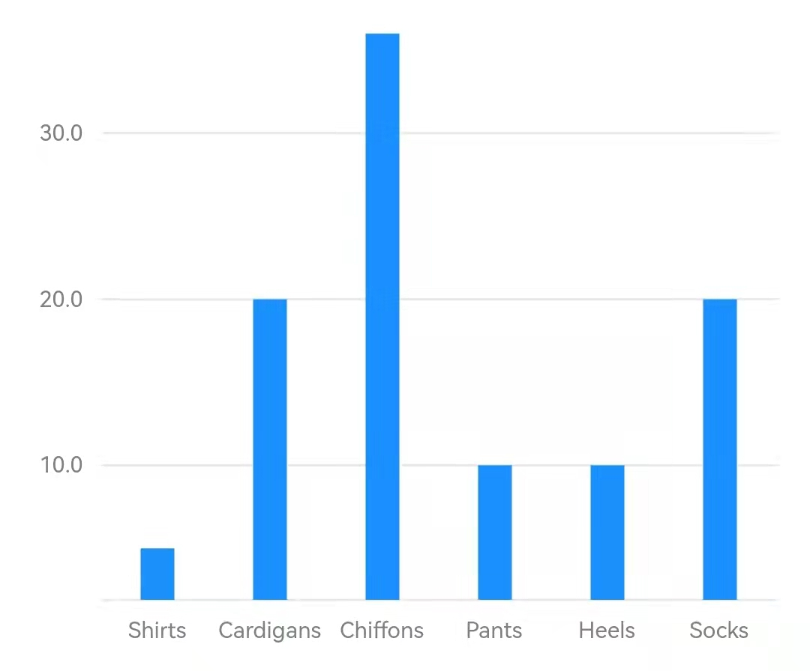
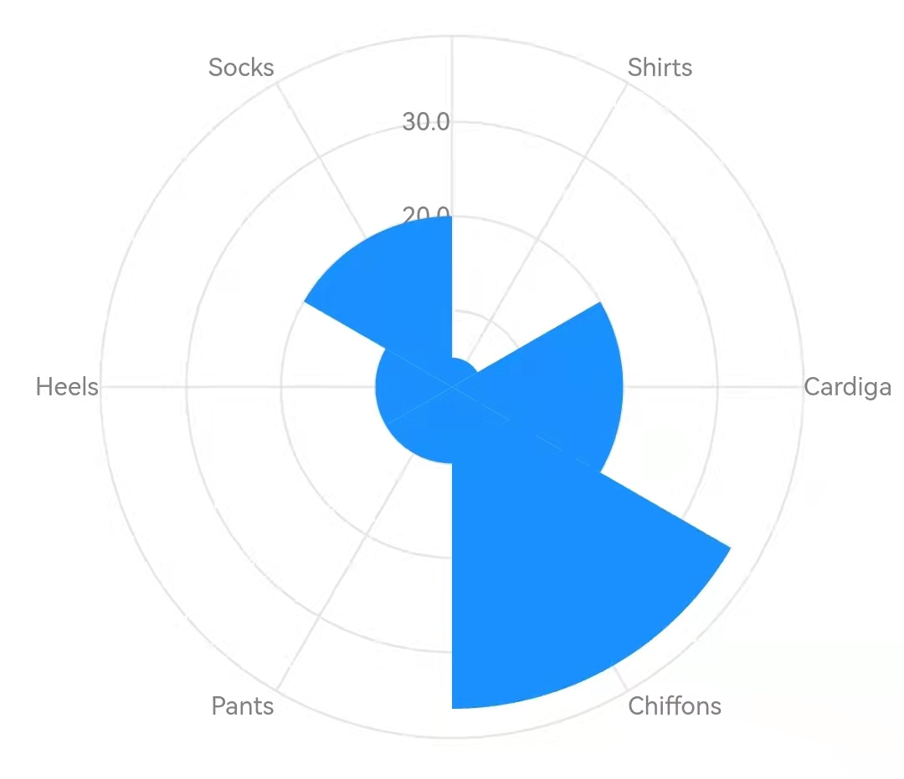
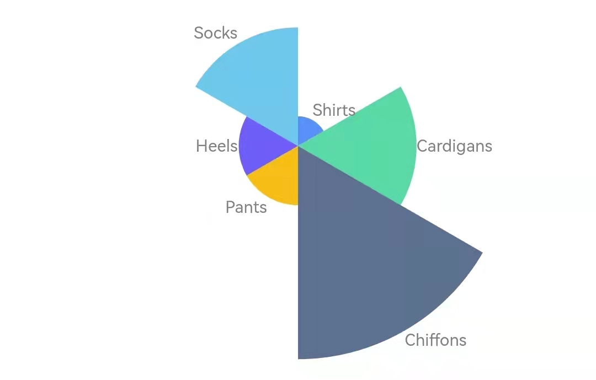
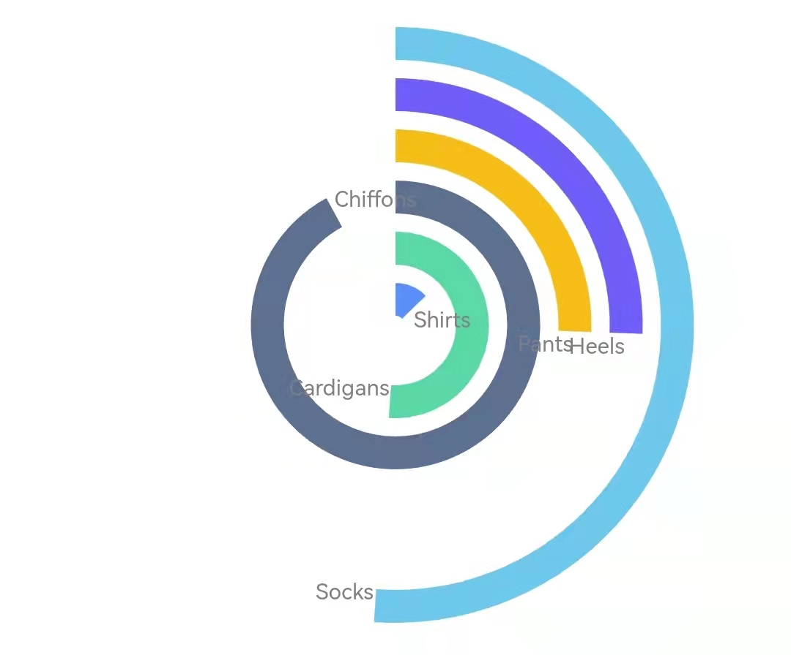

数据如下所示

```dart
const data = [
  {'category': 'Shirts', 'sales': 5},
  {'category': 'Cardigans', 'sales': 20},
  {'category': 'Chiffons', 'sales': 36},
  {'category': 'Pants', 'sales': 10},
  {'category': 'Heels', 'sales': 10},
  {'category': 'Socks', 'sales': 20},
];
```

在图表组件 [Chart](https://pub.dev/documentation/graphic/latest/graphic/Chart-class.html) 中声明定义如下：

```dart
Chart(
  data: data,
  variables: {
    'category': Variable(
      accessor: (Map map) => map['category'] as String,
    ),
    'sales': Variable(
      accessor: (Map map) => map['sales'] as num,
    ),
  },
  elements: [IntervalElement()],
  axes: [
    Defaults.horizontalAxis,
    Defaults.verticalAxis,
  ],
)
```

这样一个基本的柱状图就绘制完成了




**数据与变量**

图表的数据通过 `data` 字段引入，可以是任意元素类型的数组。在图表的内部，这些数据项将会被转换成标准的 [Tuple](https://pub.dev/documentation/graphic/latest/graphic/Tuple.html) 类型。数据项如何转换为 [Tuple](https://pub.dev/documentation/graphic/latest/graphic/Tuple.html) 中的字段则是由变量（[Variable](https://pub.dev/documentation/graphic/latest/graphic/Variable-class.html)）定义的。

可以看到，这个基本示例中，由于大多采用了默认设置，定义是很简短的，但 [Variable.accessor](https://pub.dev/documentation/graphic/latest/graphic/Variable/accessor.html) 却几乎占据了一半篇幅。为了能在 Dart 这种类型严格的语言中允许任意的输入数据类型，这是必不可少的。

**几何元素**

图形语法最重要的特点就是区分了抽象的数据图（Graph）和具体的图形（Graphic）。两者用一个通俗的例子描述就是：数据描述的是一段区间（Interval），这称之为 Graph；而这段区间在图上用柱子表示，多高多宽，这称之为 Graphic。生成 Graph 和 Graphic 的环节分别被称之为几何（Geometry）和具象（Aesthetic）。

这两者的定义都在`elements` 字段中。[GeomElement](https://pub.dev/documentation/graphic/latest/graphic/GeomElement-class.html) 的类型决定了 Graph，它分为：

- [PointElement](https://pub.dev/documentation/graphic/latest/graphic/PointElement-class.html) ：点
- [LineElement](https://pub.dev/documentation/graphic/latest/graphic/LineElement-class.html)：点连成的线
- [AreaElement](https://pub.dev/documentation/graphic/latest/graphic/AreaElement-class.html)：线之间的区域
- [IntervalElement](https://pub.dev/documentation/graphic/latest/graphic/IntervalElement-class.html)：两点之间的区间
- [PolygonElement](https://pub.dev/documentation/graphic/latest/graphic/PolygonElement-class.html)：分割平面的多边形

Graph 和 Graphic 的概念，触达了数据与可视化之间的本质关系，也使得图形语法跳出了传统图表分类的束缚。下面一部中我们可以看到，我们常说的“柱状图”和“玫瑰图”，反映数据关系的本质是一样的，只需一行坐标变换，两者就能互换。

**极坐标**

坐标将不同的变量分配到了平面上不同的维度中。对于直角坐标，维度分别是水平和垂直，对于极坐标，维度则分别是角度和半径。

“柱状图”是在直角坐标系中，将`category` 和`sales` 分别分配给了水平和垂直，而“玫瑰图”则将`category` 和`sales` 分别分配给了角度和半径。

示例中没有指明 `coord` 字段，因此坐标系是默认的直角坐标。我们添加一行指定极坐标：

```dart
coord: PolarCoord()
```

则图表变为“玫瑰图”：



当然，这个“一键切换”的图形是很不完美的，需要接着处理。

**度量**

第一个问题是

```dart
'sales': Variable(
  accessor: (Map map) => map['sales'] as num,
  scale: LinearScale(min: 0),
),
```


**具象属性**

第二个问题是，不同的扇区挨在一起，需要颜色区分一下，而且玫瑰图中人们似乎更喜欢用标签而不是坐标轴进行标注。

类似颜色、标签等，人们用来感知图形的，称之为具象属性（Aesthetic Attribute），它们也是在 `element` 中配置的。具象属性不总是直接指定属性的值，它们更多的是定义将变量值转换为这些属性值的规则，从而为不同的数据项渲染出不同的属性：

```dart
elements: [IntervalElement(
  color: ColorAttr(
    variable: 'category',
    values: Defaults.colors10,
  ),
  label: LabelAttr(
    encode: (tuple) => Label(
      tuple['category'].toString(),
    ),
  ),
)],
```




**坐标反转**

```dart
coord: PolarCoord(transposed: true)
```



**变量转换**

```dart
transforms: [
  Proportion(
    variable: 'sales',
    as: 'percent',
  ),
]
```

**图形代数**

```dart
position: Varset('category') * Varset('percent')
```


**堆叠**

```dart
elements: [IntervalElement(
  ...
  groupBy: 'category',
  modifiers: [StackModifier()],
)]
```


**坐标维度**

```dart
Chart(
  data: data,
  variables: {
    'category': Variable(
      accessor: (Map map) => map['category'] as String,
    ),
    'sales': Variable(
      accessor: (Map map) => map['sales'] as num,
      scale: LinearScale(min: 0),
    ),
  },
  transforms: [
    Proportion(
      variable: 'sales',
      as: 'percent',
    ),
  ],
  elements: [IntervalElement(
    position: Varset('percent'),
    groupBy: 'category',
    modifiers: [StackModifier()],
    color: ColorAttr(
      variable: 'category',
      values: Defaults.colors10,
    ),
    label: LabelAttr(
      encode: (tuple) => Label(
        tuple['category'].toString(),
        LabelStyle(Defaults.runeStyle),
      ),
    ),
  )],
  coord: PolarCoord(
    transposed: true,
    dimCount: 1,
  ),
)
```

