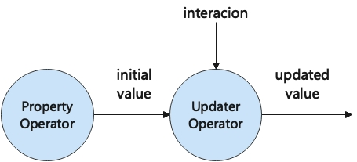
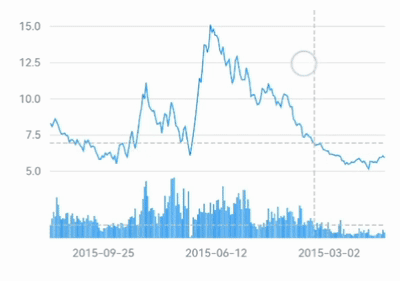
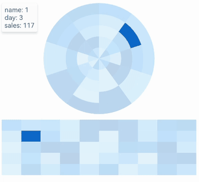

Interactions are always important in data visualization. The Flutter charting library [Graphic](https://github.com/entronad/graphic) has a well-designed interaction system for various interactive charts.

This system is built on several concepts, and when you leant these concepts you will find it's quite easy and flexible to handle interactions in [Graphic](https://github.com/entronad/graphic). Some of the concepts are novel, but intuitive and easy to understand.

This article will introduce these concepts to help you build interactive charts in Flutter with [Graphic](https://github.com/entronad/graphic).

# Gesture

As a touch-first GUI framework, interactions in Flutter is based on gestures.

There are two layers of the gesture system. The first layer has raw pointer events that describe the location and movement of pointers (for example, touches, mice, and styli) across the screen.The second layer has *gestures* that describe semantic actions that consist of one or more pointer movements. Note that gestures include not only touches, but also all other pointer kinds on multi-platforms.

Since [Graphic](https://github.com/entronad/graphic) is a widget level visualization library, we chose the gestures layer as the foundation for the interaction system. The [Gesture](https://pub.dev/documentation/graphic/latest/graphic/Gesture-class.html) class carries information about a gesture. It is mainly used in [GestureSignal](https://pub.dev/documentation/graphic/latest/graphic/GestureSignal-class.html)s.

The widely used widget that handles gestures in Flutter is the [GestureDetector](https://api.flutter.dev/flutter/widgets/GestureDetector-class.html). It defines all the gesture types in its callback properties (like [onTap](https://api.flutter.dev/flutter/widgets/GestureDetector-class.html)), and developers are familiar with them. So [Graphic](https://github.com/entronad/graphic) inherits this taxonomy. The [GestureType](https://pub.dev/documentation/graphic/latest/graphic/GestureType.html)s of [Graphic](https://github.com/entronad/graphic) have same names (without the `on` prefix) and meanings to their corresponding callback properties in GestureDetector, such as `GestureType.tap` to `GestureDetector.onTap`. This keeps [Graphic](https://github.com/entronad/graphic) consistent with the Flutter gesture system and friendly to developers.

# Signal

To represent interactions, there are two levels of abstraction: *signals* and *selections*. These two concepts are referred to Vega, yet there are some differences in [Graphic](https://github.com/entronad/graphic).

[Signal](https://pub.dev/documentation/graphic/latest/graphic/Signal-class.html)s are also called "events" in some other systems. They are emitted when users or external changes interact with the chart. They carry information about the interaction. Signals are mainly used in updaters, like [RectCoord.horizontalRangeUpdater](https://pub.dev/documentation/graphic/latest/graphic/RectCoord/horizontalRangeUpdater.html), or trigger selections internally.

Although the same name, signals in [Graphic](https://github.com/entronad/graphic) have different meaning to [signals in Vega](https://vega.github.io/vega/docs/signals/). In Vega, signals are dynamic variables that parameterize a visualization, that means they provide values persistently, whether there are interactions or not. But in [Graphic](https://github.com/entronad/graphic), signals are avatars of interactions, so they only occur when triggered and carry the whole information of the interaction, not only a variable value.

Except the [GestureSignal](https://pub.dev/documentation/graphic/latest/graphic/GestureSignal-class.html) for user interactions, there are also [ChangeDataSignal](https://pub.dev/documentation/graphic/latest/graphic/ChangeDataSignal-class.html) and [ResizeSignal](https://pub.dev/documentation/graphic/latest/graphic/ResizeSignal-class.html) for the external changes that effects the chart, which are also "interactions" in a broad sense.

Internally, different signals, no matter its kind or emitter, will be broadcasted by a reducer to all signal updaters. This makes developers unconstrained to decide which signal the updater will respond to.

# Selection

A [selection](https://pub.dev/documentation/graphic/latest/graphic/Selection-class.html) is a data query driven by gestures. They are the result of signals. When a selection is triggered, data tuples become either selected or unselected states, thus may causing their aesthetic attributes change if `Attr.onSelection` is defined.

The rules of selections in [Graphic](https://github.com/entronad/graphic) are mainly from [selections in Vega-Lite](https://vega.github.io/vega-lite/docs/selection.html), so there are [IntervalSelection](https://pub.dev/documentation/graphic/latest/graphic/IntervalSelection-class.html) and [PointSelection](https://pub.dev/documentation/graphic/latest/graphic/PointSelection-class.html).

Unlike most other visualization libraries, a selection in [Graphic](https://github.com/entronad/graphic) is tested in data value space, not by graphical shape intersections. The pointer coordinates will be inverted into data values in each dimension, and these values will be searched in data list to find the results. This approach is more "data-driven" and performs better than shape intersection test in big data.

Generally speaking, signals are raw and more flexible to use, while selections are more concise and focus on the data domain.

# Updater

In [Graphic](https://github.com/entronad/graphic), the basic idea of how interactions affect the chart is that they do not provide values to the chart directly, instead, they update existing property values in the chart and cause a reactive rendering. The calculation of property value and updating are in different operators, and the initial value (usually indicated in the specification) will be kept:



Updaters are callback functions to update property values according to interactions, like [RectCoord.horizontalRangeUpdater](https://pub.dev/documentation/graphic/latest/graphic/RectCoord/horizontalRangeUpdater.html) or [Attr.updaters](https://pub.dev/documentation/graphic/latest/graphic/Attr/updaters.html). Since there are two kinds of interaction, there are two kinds of updaters correspondingly, [SignalUpdater](https://pub.dev/documentation/graphic/latest/graphic/SignalUpdater.html) and [SelectionUpdater](https://pub.dev/documentation/graphic/latest/graphic/SelectionUpdater.html):

```
SignalUpdater<V> = V Function(
  V initialValue,
  V preValue,
  Signal signal
)

SelectionUpdater<V> = V Function(
  V initialValue
)
```

We can see that the advantage of such structure is that user can control the value status better by the initial value and prior value stored in the operators. 

# Interaction Channel

For common cases of interaction, features above are enough. But we introduced *interaction channels* for advanced usage.

The interaction channel is a way for two-way communication with the chart. You can input and output interaction information through it. That is to say, you can manually emit a signal or selection to the chart and get noticed from the chart when a signal or selection occurs. It makes a more flexible and precise control of interaction.

To achieve this, we consider about the idea of Functional Reactive Programming (FRP). Fortunately, the Dart language has a built-in [asynchronous stream system](https://dart.dev/tutorials/language/streams), which is an simple implementation for FRP. The [StreamController](https://api.dart.dev/stable/2.18.3/dart-async/StreamController-class.html) class can play the role of interaction channels.

A good field to show the advantage of interaction channels is chart coupling. Think about that there are two different charts, coupling means when interacting with one chart, the other one acts the same, and vice versa.

For example, two charts show the prices and volumes of a stock respectively, touch on one chart to show the auxiliary line, the other should show the same:



You just need to let the two charts share the same gesture signal channel, and they will share all gestures, without any redundant input and output properties:

```
final priceVolumeChannel = StreamController<GestureSignal>.broadcast();

// the price chart
Chart(
  ...
  gestureChannel: priceVolumeChannel,
)

// the volume chart
Chart(
  ...
  gestureChannel: priceVolumeChannel,
)
```

Another example is two charts always select the same day:



A shared selection channel of the two elements will do:

```
final heatmapChannel = StreamController<Selected?>.broadcast();

// the above chart
Chart(
  ...
  elements: [PolygonElement(
    selectionChannel: heatmapChannel,
  )]
)

// the below chart
Chart(
  ...
  elements: [PolygonElement(
    selectionChannel: heatmapChannel,
  )]
)
```

 The complete code of the two examples above is [here](https://github.com/entronad/graphic/blob/main/example/lib/pages/interaction_channel_dynamic.dart).